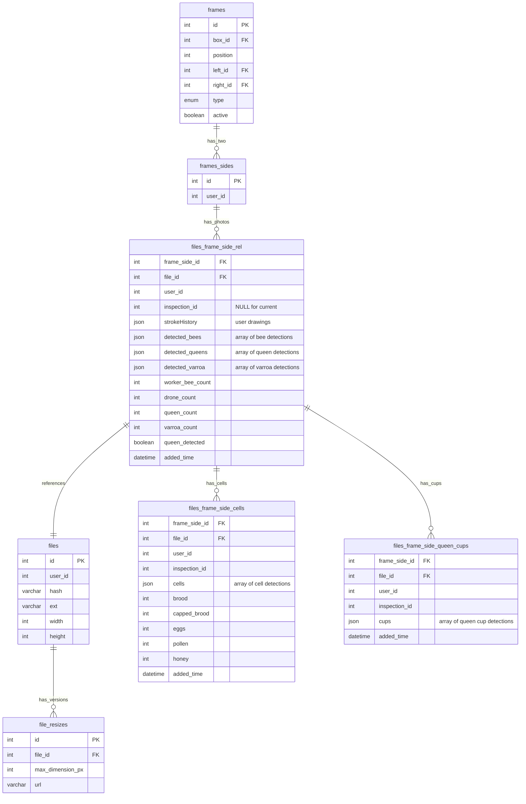
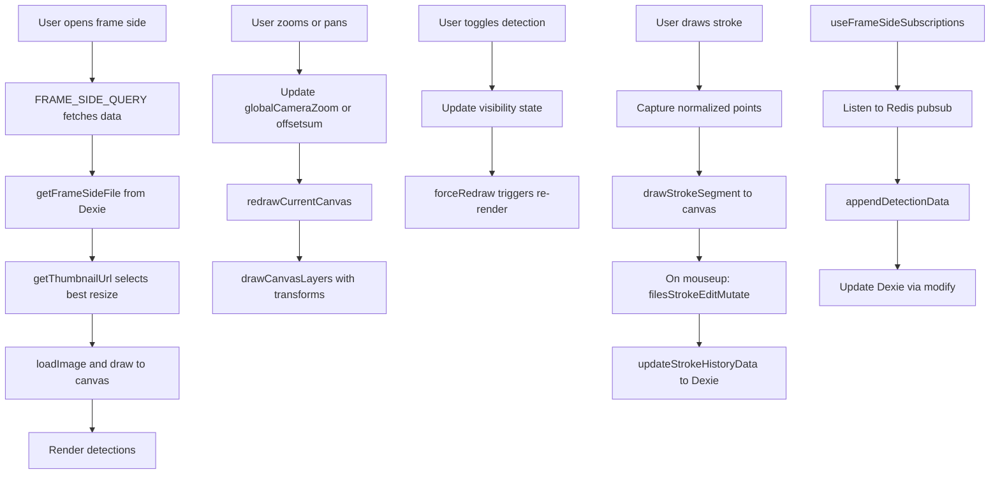

# Frame Side Management - Technical Documentation

### 🎯 Overview
Interactive frame photo viewer with zoom, pan, detection overlay toggling, and annotation capabilities. Supports progressive image loading, canvas-based drawing, and real-time detection visualization for comprehensive frame analysis.

### 🏗️ Architecture

#### Components
- **FrameSide**: Main container component fetching frame side data and managing upload state
- **FrameSideDrawing**: Core canvas component handling drawing, zoom, pan, and detection overlays
- **DrawingCanvas**: Canvas rendering with integrated detection visualization and user annotations
- **uploadFile**: File upload component for initial frame photo upload

#### Services
- **image-splitter**: Stores uploaded images, serves resized versions, manages detection data as JSON
- **swarm-api**: Stores frame/box structure and frame_side references
- **web-app**: Frontend React application with Dexie local database caching

### 📋 Technical Specifications

#### Database Schema


#### GraphQL API
```text
type FrameSide {
  id: ID!
  frameId: ID
  isQueenConfirmed: Boolean
  file: File
  cells: FrameSideCells
  frameSideFile: FrameSideFile
  inspections: [FrameSideInspection]
}

type FrameSideFile {
  file: File!
  frameSideId: ID
  hiveId: ID
  strokeHistory: JSON
  detectedBees: JSON
  detectedQueenCount: Int
  detectedWorkerBeeCount: Int
  detectedDroneCount: Int
  isBeeDetectionComplete: Boolean
  detectedCells: JSON
  isCellsDetectionComplete: Boolean
  detectedQueenCups: JSON
  isQueenCupsDetectionComplete: Boolean
  isQueenDetectionComplete: Boolean
  queenDetected: Boolean!
  workerCount: Int
  droneCount: Int
  detectedVarroa: JSON
  varroaCount: Int
}

type File {
  id: ID!
  url: URL!
  resizes: [FileResize]
}

type FileResize {
  id: ID!
  file_id: ID!
  max_dimension_px: Int!
  url: URL!
}

type FrameSideCells {
  id: ID!
  broodPercent: Int
  cappedBroodPercent: Int
  eggsPercent: Int
  pollenPercent: Int
  honeyPercent: Int
}

type FrameSideInspection {
  frameSideId: ID!
  inspectionId: ID!
  file: File
  cells: FrameSideCells
  frameSideFile: FrameSideFile
}

type Query {
  hiveFrameSideFile(frameSideId: ID!): FrameSideFile
  hiveFrameSideCells(frameSideId: ID!): FrameSideCells
  frameSidesInspections(frameSideIds: [ID], inspectionId: ID!): [FrameSideInspection]
  file(id: ID!): File
  hiveFiles(hiveId: ID!): [FrameSideFile]
  boxFiles(boxId: ID!, inspectionId: ID): [BoxFile]
}

type Mutation {
  uploadFrameSide(file: Upload!): File
  addFileToFrameSide(frameSideId: ID!, fileId: ID!, hiveId: ID!): Boolean
  filesStrokeEditMutation(files: [FilesUpdateInput]): Boolean
  updateFrameSideCells(cells: FrameSideCellsInput!): Boolean!
  confirmFrameSideQueen(frameSideId: ID!, isConfirmed: Boolean!): Boolean!
  cloneFramesForInspection(frameSideIDs: [ID], inspectionId: ID!): Boolean!
}

input FilesUpdateInput {
  frameSideId: ID!
  fileId: ID!
  strokeHistory: JSON!
}

input FrameSideCellsInput {
  id: ID!
  broodPercent: Int
  cappedBroodPercent: Int
  eggsPercent: Int
  pollenPercent: Int
  honeyPercent: Int
}
```

### 🔧 Implementation Details

#### Frontend (web-app)
- **Framework**: React with TypeScript
- **Canvas Rendering**: HTML5 Canvas API
- **Drawing**: Pointer Events API for mouse and touch support
- **Zoom**: CSS transforms with GPU acceleration
- **Image Loading**: Progressive JPEG with blur-up effect

#### Progressive Image Loading
```
1. Initial load: Select best resize from file_resizes table (>128px width)
2. Image loaded via HTMLImageElement and drawn to canvas
3. Canvas size calculated based on viewport width and device pixel ratio
4. Resizes stored with max_dimension_px and URL in database
```

#### Zoom and Pan Implementation
- **Zoom Range**: MIN_ZOOM (1x) to MAX_ZOOM (100x)
- **Medium Zoom**: MED_ZOOM (2x) for mobile detection
- **Zoom Mechanism**: Canvas transform scale with globalCameraZoom
- **Pan**: Drag-based translation with offsetsum (x, y coordinates)
- **Pan Control**: isPanning flag, startPanPosition, initialPanOffset tracking
- **Mobile**: Zoom disabled on viewports < 1200px width
- **Constraints**: Prevent zoom below 1x, above 100x


#### Drawing Tool Implementation
- **Freehand Drawing**: Capture pointer move events with pressure support
- **Path Storage**: strokeHistory array of DrawingLine arrays, each containing DrawingPoint (x, y, lineWidth, color)
- **Drawing Points**: Normalized coordinates (0-1) relative to canvas dimensions
- **Line Rendering**: Quadratic curves for smooth strokes via quadraticCurveTo
- **Undo**: Pop last stroke from strokeHistory array
- **Clear**: Empty strokeHistory array
- **Persistence**: filesStrokeEditMutation saves to backend, updateStrokeHistoryData updates Dexie cache

#### Data Flow



### 🧪 Testing

#### Unit Tests
- Zoom calculations and constraints
- Detection overlay rendering logic
- Drawing path capture and storage
- Image URL selection based on zoom level
- Detection toggle state management

#### Integration Tests
- Progressive image loading sequence
- Detection data sync with backend
- Annotation persistence
- Canvas rendering performance
- Touch event handling on mobile

#### E2E Tests
- User uploads photo and views it
- User zooms in and out smoothly
- User toggles detection types on/off
- User draws annotation and undos
- User switches between frame sides

### 📊 Performance Considerations

#### Optimizations
- **Canvas Memoization**: React.memo on detection overlay
- **Render Throttling**: RequestAnimationFrame for smooth zoom
- **Image Preloading**: Prefetch next zoom level
- **Detection Batching**: Render all same-type detections in one pass
- **GPU Acceleration**: CSS transforms for zoom/pan
- **Lazy Rendering**: Only render visible detections

#### Metrics
- Initial load: under 500ms (small image)
- Zoom transition: under 100ms (60fps)
- Detection toggle: under 50ms
- Drawing responsiveness: under 16ms (60fps)
- Memory: under 100MB for large images

#### Bottlenecks
- Large images (over 4000x3000px) may impact mobile devices
- Many detections (over 1000) slow overlay rendering
- Drawing with many paths (over 100) affects undo performance

### 🚫 Technical Limitations
- Maximum zoom 100x (may pixelate at extreme zoom levels)
- Drawing tools limited to freehand (no shapes, text)
- No collaborative annotation (single user only)
- Annotations not versioned (overwrite on save)
- Mobile performance degraded with very large images
- Zoom disabled on mobile devices (< 1200px width)

### 🔗 Related Documentation
- [Frame Photo Upload Technical Documentation](./frame-photo-upload.md)
- [Queen Detection Technical Documentation](./queen-detection.md)

### 📚 Development Resources
- [web-app frame components](https://github.com/Gratheon/web-app/tree/main/src/page/hiveEdit/frame)
- [image-splitter GraphQL resolvers](https://github.com/Gratheon/image-splitter/blob/main/src/graphql/resolvers.ts)
- [Canvas API Documentation](https://developer.mozilla.org/en-US/docs/Web/API/Canvas_API)
- [Pointer Events API](https://developer.mozilla.org/en-US/docs/Web/API/Pointer_events)

### 💬 Technical Notes
- Pan support is implemented but could be improved with touch gestures
- WebGL renderer may improve performance for many detections
- Consider WebP format for smaller image sizes with same quality
- Drawing tool could benefit from SVG overlay instead of Canvas for better quality
- Touch gestures (pinch zoom) would improve mobile experience (currently zoom disabled on mobile)
- Consider adding measurement tools (ruler, area calculator)

---
**Last Updated**: December 5, 2025
