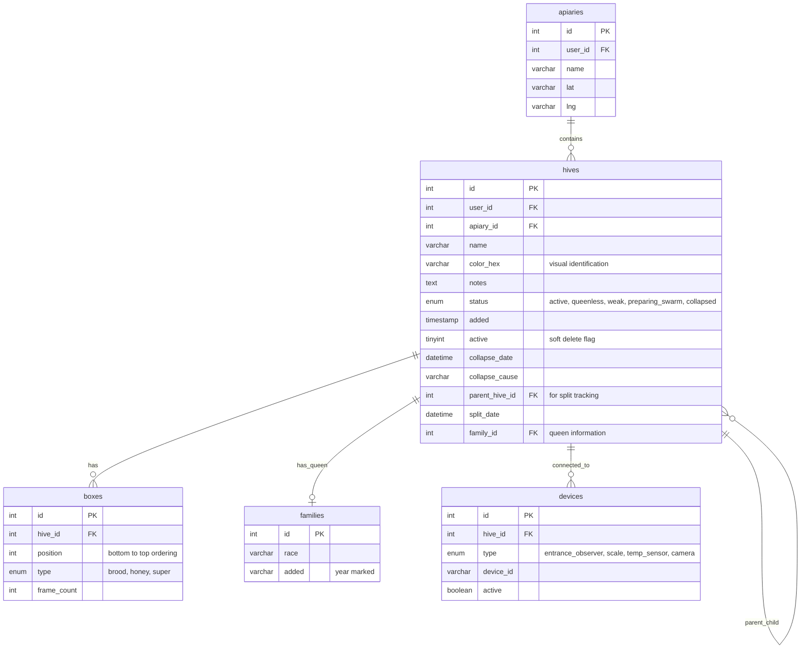
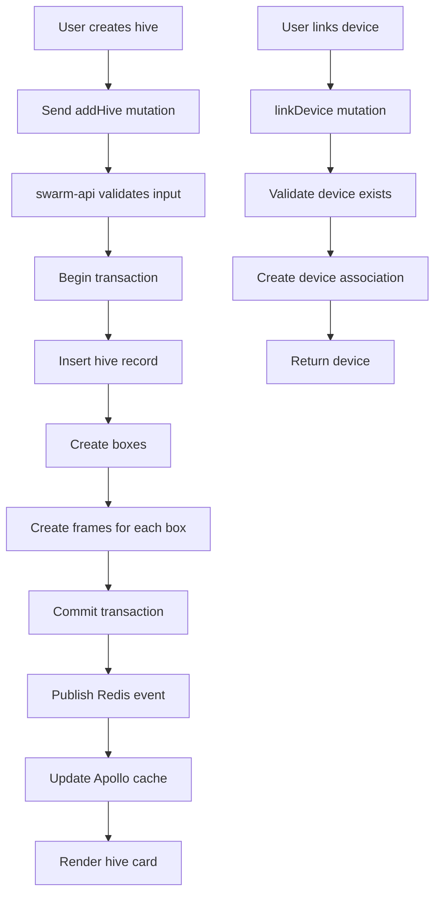

# Hive Management - Technical Documentation

### 🎯 Overview
Core beehive CRUD operations with hierarchical structure management, status tracking, device integration, and colony lineage support. Enables beekeepers to create and organize individual hive records with equipment tracking and sensor associations.

### 🏗️ Architecture

#### Components
- **HiveList**: React component displaying all hives in an apiary
- **HiveCard**: Individual hive visualization with color, name, status
- **HiveEditor**: Form component for creating/editing hive details
- **HiveStatusBadge**: Visual indicator for hive health status
- **DeviceAssociationPanel**: UI for linking sensors and cameras

#### Services
- **swarm-api**: Primary service handling hive CRUD operations
- **gate-video-stream**: Integrates for entrance observer cameras
- **beehive-sensors**: Links temperature/humidity sensors
- **graphql-router**: Federated gateway routing hive queries

### 📋 Technical Specifications

#### Database Schema


#### GraphQL API
```graphql
type Hive {
  id: ID!
  name: String!
  color: String
  status: HiveStatus!
  notes: String
  apiary: Apiary!
  boxes: [Box!]!
  family: Family
  devices: [Device!]
  parentHive: Hive
  childHives: [Hive!]
  collapseDate: DateTime
  collapseCause: String
  splitDate: DateTime
  added: DateTime!
  active: Boolean!
}

enum HiveStatus {
  ACTIVE
  QUEENLESS
  WEAK
  PREPARING_SWARM
  COLLAPSED
}

type Box {
  id: ID!
  position: Int!
  type: BoxType!
  frameCount: Int!
  frames: [Frame!]
}

enum BoxType {
  BROOD
  HONEY
  SUPER
}

type Device {
  id: ID!
  type: DeviceType!
  deviceId: String!
  active: Boolean!
}

enum DeviceType {
  ENTRANCE_OBSERVER
  SCALE
  TEMP_SENSOR
  CAMERA
}

input HiveInput {
  apiaryId: ID!
  name: String!
  color: String
  notes: String
  boxCount: Int!
  framesPerBox: Int!
}

input UpdateHiveInput {
  id: ID!
  name: String
  color: String
  notes: String
  status: HiveStatus
}

type Query {
  hive(id: ID!): Hive!
  hives(apiaryId: ID!): [Hive!]!
  hivesByStatus(status: HiveStatus!): [Hive!]!
}

type Mutation {
  addHive(input: HiveInput!): Hive!
  updateHive(input: UpdateHiveInput!): Hive!
  deleteHive(id: ID!): Boolean!
  setHiveStatus(hiveId: ID!, status: HiveStatus!): Hive!
  linkDevice(hiveId: ID!, deviceType: DeviceType!, deviceId: String!): Device!
  unlinkDevice(deviceId: ID!): Boolean!
}
```

### 🔧 Implementation Details

#### Frontend (web-app)
- **Framework**: React with TypeScript
- **State Management**: Apollo Client cache
- **Color Picker**: React color picker for hive identification
- **Status Selection**: Dropdown with icon indicators
- **Drag-and-Drop**: For reordering hives within apiary (future)

#### Backend (swarm-api)
- **Language**: Go
- **Database**: MySQL with foreign key constraints
- **Transactions**: Atomic hive + boxes + frames creation
- **Soft Deletes**: active flag prevents data loss
- **Cascade Rules**: ON DELETE CASCADE for boxes/frames

#### Key Operations

**Create Hive**
```go
func (r *mutationResolver) AddHive(ctx context.Context, input HiveInput) (*Hive, error) {
    tx := r.DB.Begin()
    
    // Create hive record
    hive := &Hive{
        UserID: userID,
        ApiaryID: input.ApiaryId,
        Name: input.Name,
        Color: input.Color,
        Status: "active",
    }
    tx.Create(hive)
    
    // Create initial boxes and frames
    for i := 0; i < input.BoxCount; i++ {
        box := &Box{
            HiveID: hive.ID,
            Position: i,
            Type: "brood",
            FrameCount: input.FramesPerBox,
        }
        tx.Create(box)
        
        // Create frames for this box
        for j := 0; j < input.FramesPerBox; j++ {
            frame := &Frame{
                BoxID: box.ID,
                Position: j,
            }
            tx.Create(frame)
        }
    }
    
    tx.Commit()
    return hive, nil
}
```

#### Data Flow


### ⚙️ Configuration

**Environment Variables (swarm-api)**
```bash
MYSQL_HOST=localhost
MYSQL_PORT=3306
MYSQL_DATABASE=swarm
MYSQL_USER=swarm_api
MYSQL_PASSWORD=<secret>

JWT_SECRET=<secret>

REDIS_HOST=localhost:6379
REDIS_PASSWORD=<secret>

DEFAULT_BOX_COUNT=2
DEFAULT_FRAMES_PER_BOX=10
MAX_BOXES_PER_HIVE=10
MAX_FRAMES_PER_BOX=12
```

### 🧪 Testing

#### Unit Tests
- Hive CRUD operations
- Status transitions validation
- Color hex validation
- Device linking logic
- Soft delete behavior

#### Integration Tests
- Full hive creation with boxes and frames
- Hive update preserves relationships
- Hive deletion cascades to boxes/frames
- Device association and unlinking
- Parent-child hive relationships

#### E2E Tests
- User creates hive with 2 boxes, 10 frames each
- User edits hive name and color
- User changes hive status to queenless
- User links entrance observer device
- User deletes hive (soft delete)

### 📊 Performance Considerations

#### Optimizations
- Database indexes on user_id, apiary_id, active
- Transaction batching for hive + boxes + frames creation
- Redis caching for frequently accessed hives
- Pagination for large apiary hive lists
- Lazy loading of boxes and frames

#### Metrics
- Hive creation: under 300ms (with 2 boxes, 20 frames)
- Hive update: under 100ms
- Hive deletion (soft): under 50ms
- Hive list query: under 200ms (with 50 hives)
- Device linking: under 100ms

#### Bottlenecks
- Creating hives with many boxes (over 5) and frames (over 50 total)
- Querying hive list with full box/frame data (use pagination)
- Real-time updates for many concurrent users

### 🚫 Technical Limitations
- Maximum 10 boxes per hive (configurable)
- Maximum 12 frames per box (standard Langstroth)
- Color must be valid hex code (#RRGGBB)
- Cannot restore hard-deleted hives
- Device must exist before linking (no auto-creation)
- Parent-child relationships don't track merge operations (only splits)

### 🔗 Related Documentation
- [Apiary Management Technical Documentation](./apiary-management.md)
- [Split Colony Technical Documentation](./split-colony.md)
- [Join Colonies Technical Documentation](./join-colonies.md)

### 📚 Development Resources
- [swarm-api repository](https://github.com/Gratheon/swarm-api)
- [GraphQL schema](https://github.com/Gratheon/graphql-schema-registry)
- [Hive management UI](https://github.com/Gratheon/web-app/src/components/HiveCard)

### 💬 Technical Notes
- Consider adding GPS coordinates at hive level (currently only at apiary level)
- Status transitions could be automated based on queen detection results
- Color picker could suggest colors based on beekeeping year marking convention
- May want to add "notes" timeline to track inspection observations over time
- Device linking could benefit from QR code scanning for easier setup
- Consider adding hive templates for common configurations (8-frame, 10-frame, top-bar)

---
**Last Updated**: December 5, 2025
**Maintained By**: Backend Team

