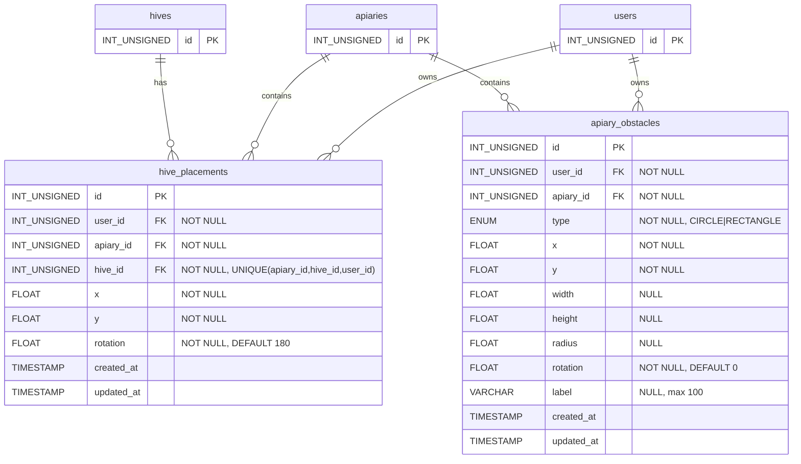

# Hive Placement Planner - Technical Documentation

### 🎯 Overview
Interactive canvas-based planning tool for optimal hive placement within apiaries. Features real-time sun simulation, polygonal shadow rendering, and comprehensive object manipulation with auto-save functionality. Built with HTML5 Canvas and React hooks.

### 🏗️ Architecture

#### Components
- **HivePlacement**: Main React component (`/web-app/src/page/apiaryEdit/hivePlacement/index.tsx`)
- **Canvas Rendering**: Custom drawing functions for hives, obstacles, shadows, and UI elements
- **State Management**: React hooks with Map-based placements for O(1) lookups

#### Services
- **swarm-api**: Hive placement CRUD, obstacle management, GraphQL API
- **web-app**: Frontend React application with canvas rendering
- **mysql**: Data persistence for placements and obstacles

### 📋 Technical Specifications

#### Database Schema

Migration: `20251208190000_add_hive_placement.sql`



**Indexes:**
- `hive_placements`: `idx_apiary_user (apiary_id, user_id)`
- `apiary_obstacles`: `idx_apiary_user (apiary_id, user_id)`

**Constraints:**
- All foreign keys: `ON DELETE CASCADE`
- `hive_placements`: Unique constraint on `(apiary_id, hive_id, user_id)`

#### GraphQL API
```graphql
type HivePlacement {
  id: ID!
  apiaryId: ID!
  hiveId: ID!
  x: Float!
  y: Float!
  rotation: Float!
}

type ApiaryObstacle {
  id: ID!
  apiaryId: ID!
  type: ObstacleType!
  x: Float!
  y: Float!
  width: Float
  height: Float
  radius: Float
  rotation: Float!
  label: String
}

enum ObstacleType {
  CIRCLE
  RECTANGLE
}

input ApiaryObstacleInput {
  type: ObstacleType!
  x: Float!
  y: Float!
  width: Float
  height: Float
  radius: Float
  rotation: Float!
  label: String
}

# Queries
hivePlacements(apiaryId: ID!): [HivePlacement!]!
apiaryObstacles(apiaryId: ID!): [ApiaryObstacle!]!

# Mutations
updateHivePlacement(
  apiaryId: ID!
  hiveId: ID!
  x: Float!
  y: Float!
  rotation: Float!
): HivePlacement!

addApiaryObstacle(
  apiaryId: ID!
  obstacle: ApiaryObstacleInput!
): ApiaryObstacle!

updateApiaryObstacle(
  id: ID!
  obstacle: ApiaryObstacleInput!
): ApiaryObstacle!

deleteApiaryObstacle(id: ID!): Boolean!
```

### 🔧 Implementation Details

#### Frontend Architecture

**State Management**
```typescript
// Placements stored as Map for O(1) access
const [placements, setPlacements] = useState<Map<string, HivePlacement>>(new Map())
const [obstacles, setObstacles] = useState<Obstacle[]>([])

// Interaction states
const [selectedHive, setSelectedHive] = useState<string | null>(null)
const [selectedObstacle, setSelectedObstacle] = useState<string | null>(null)
const [isDragging, setIsDragging] = useState(false)
const [isDraggingRotation, setIsDraggingRotation] = useState(false)
const [isDraggingObstacle, setIsDraggingObstacle] = useState(false)
const [isResizingObstacle, setIsResizingObstacle] = useState(false)
const [isDraggingObstacleRotation, setIsDraggingObstacleRotation] = useState(false)

// Sun simulation
const [sunAngle, setSunAngle] = useState(90) // Start at East
const [autoRotate, setAutoRotate] = useState(false)
```

**Canvas Dimensions**
```typescript
const HIVE_SIZE = 30 // pixels
const CANVAS_HEIGHT = 600 // fixed height
const [canvasWidth, setCanvasWidth] = useState(800) // dynamic, responsive

// ResizeObserver for width tracking
useEffect(() => {
  const updateCanvasWidth = () => {
    if (containerRef.current) {
      const width = containerRef.current.offsetWidth
      setCanvasWidth(Math.max(600, width))
    }
  }
  
  const observer = new ResizeObserver(updateCanvasWidth)
  if (containerRef.current) observer.observe(containerRef.current)
  
  return () => observer.disconnect()
}, [])
```

**Rendering Pipeline**
```typescript
const drawCanvas = () => {
  const ctx = canvas.getContext('2d')
  
  // 1. Clear canvas
  ctx.clearRect(0, 0, canvasWidth, CANVAS_HEIGHT)
  
  // 2. Draw background
  ctx.fillStyle = '#e8f5e9'
  ctx.fillRect(0, 0, canvasWidth, CANVAS_HEIGHT)
  
  // 3. Draw compass with sun
  drawCompass(ctx)
  
  // 4. Draw shadows (obstacles + hives)
  drawShadows(ctx)
  
  // 5. Draw obstacles with handles
  drawObstacles(ctx)
  
  // 6. Draw hives with handles
  drawHives(ctx)
}
```

**Shadow Algorithm (Critical)**
```typescript
// Shadow offset calculation (away from sun)
const angleRad = (sunAngle - 90) * (Math.PI / 180)
const shadowLength = 80
const shadowOffsetX = -Math.cos(angleRad) * shadowLength  // Negative = away from sun
const shadowOffsetY = -Math.sin(angleRad) * shadowLength

// Polygonal shadow for rectangles
const drawRectangleShadow = (obstacle) => {
  const rotRad = (obstacle.rotation || 0) * (Math.PI / 180)
  
  // 1. Get rotated corners
  const corners = [
    { x: -width/2, y: -height/2 },
    { x: width/2, y: -height/2 },
    { x: width/2, y: height/2 },
    { x: -width/2, y: height/2 }
  ]
  const rotatedCorners = corners.map(c => ({
    x: obs.x + c.x * Math.cos(rotRad) - c.y * Math.sin(rotRad),
    y: obs.y + c.x * Math.sin(rotRad) + c.y * Math.cos(rotRad)
  }))
  
  // 2. Draw continuous path: object → shadow → close
  ctx.beginPath()
  // Draw object outline
  rotatedCorners.forEach((c, i) => {
    if (i === 0) ctx.moveTo(c.x, c.y)
    else ctx.lineTo(c.x, c.y)
  })
  // Draw to shadow projections (reverse order)
  for (let i = rotatedCorners.length - 1; i >= 0; i--) {
    const c = rotatedCorners[i]
    ctx.lineTo(c.x + shadowOffsetX, c.y + shadowOffsetY)
  }
  ctx.closePath()
  ctx.fill()
}
```

**Initialization Strategy (Merge Pattern)**
```typescript
useEffect(() => {
  if (loading || !hives.length) return
  
  const map = new Map()
  
  // 1. Load saved placements from backend
  if (data?.hivePlacements) {
    data.hivePlacements.forEach(p => map.set(p.hiveId, p))
  }
  
  // 2. Add defaults for hives without placements
  hives.forEach((hive, index) => {
    if (!map.has(hive.id)) {
      map.set(hive.id, {
        hiveId: hive.id,
        x: 150 + (index % 5) * 120,
        y: 150 + Math.floor(index / 5) * 100,
        rotation: 180  // South-facing by default
      })
    }
  })
  
  setPlacements(map)
  setInitializedPlacements(true)
}, [data, hives.length, loading])
```

#### Backend (Go)

**Models**
```go
// graph/model/hive_placement.go
type HivePlacement struct {
    ID       uint    `json:"id"`
    UserID   uint    `json:"userId"`
    ApiaryID uint    `json:"apiaryId"`
    HiveID   uint    `json:"hiveId"`
    X        float64 `json:"x"`
    Y        float64 `json:"y"`
    Rotation float64 `json:"rotation"`
}

func (hp *HivePlacement) Upsert(apiaryId, hiveId string, x, y, rotation float64) (*HivePlacement, error) {
    // Check for existing placement
    var existingID uint
    err := hp.Db.QueryRow(`
        SELECT id FROM hive_placements 
        WHERE apiary_id=? AND hive_id=? AND user_id=?
    `, apiaryId, hiveId, hp.UserID).Scan(&existingID)
    
    if err == sql.ErrNoRows {
        // Insert new
        result, err := hp.Db.Exec(`
            INSERT INTO hive_placements (user_id, apiary_id, hive_id, x, y, rotation)
            VALUES (?, ?, ?, ?, ?, ?)
        `, hp.UserID, apiaryId, hiveId, x, y, rotation)
        // ... handle result
    } else {
        // Update existing
        _, err = hp.Db.Exec(`
            UPDATE hive_placements 
            SET x=?, y=?, rotation=? 
            WHERE id=? AND user_id=?
        `, x, y, rotation, existingID, hp.UserID)
        // ... handle result
    }
}
```

**Resolvers**
```go
// graph/schema.resolvers.go
func (r *queryResolver) HivePlacements(ctx context.Context, apiaryID string) ([]*model.HivePlacement, error) {
    uid := ctx.Value("userID").(string)
    return (&model.HivePlacement{
        Db:     r.Resolver.Db,
        UserID: uid,
    }).List(apiaryID)
}

func (r *mutationResolver) UpdateHivePlacement(ctx context.Context, 
    apiaryID string, hiveID string, x float64, y float64, rotation float64) (*model.HivePlacement, error) {
    uid := ctx.Value("userID").(string)
    return (&model.HivePlacement{
        Db:     r.Resolver.Db,
        UserID: uid,
    }).Upsert(apiaryID, hiveID, x, y, rotation)
}
```

### 🎨 Interaction Patterns

#### Mouse Event Handling
```typescript
handleCanvasMouseDown(e) {
  const { x, y } = getMousePos(e)
  
  // Priority 1: Check selected object handles
  if (selectedObstacle) {
    if (isOverResizeHandle(x, y)) {
      setIsResizingObstacle(true)
      return
    }
    if (isOverRotationHandle(x, y)) {
      setIsDraggingObstacleRotation(true)
      return
    }
    if (isInsideObstacle(x, y)) {
      setIsDraggingObstacle(true)
      return
    }
  }
  
  // Priority 2: Check hive handles
  if (selectedHive) {
    if (isOverHiveRotationHandle(x, y)) {
      setIsDraggingRotation(true)
      return
    }
    if (isInsideHive(x, y)) {
      setIsDragging(true)
      return
    }
  }
  
  // Priority 3: Select new object
  for (const obstacle of obstacles) {
    if (isInsideObstacle(x, y, obstacle)) {
      setSelectedObstacle(obstacle.id)
      setSelectedHive(null)
      setIsDraggingObstacle(true)
      return
    }
  }
  
  for (const hive of hives) {
    if (isInsideHive(x, y, hive)) {
      setSelectedHive(hive.id)
      setSelectedObstacle(null)
      setIsDragging(true)
      return
    }
  }
}
```

#### Auto-Save Strategy
```typescript
handleCanvasMouseUp() {
  // Only save on mouse up, not on every move
  if ((isDraggingObstacle || isResizingObstacle || isDraggingObstacleRotation) 
      && selectedObstacle) {
    const obs = obstacles.find(o => o.id === selectedObstacle)
    if (obs) {
      updateObstacle({
        id: selectedObstacle,
        obstacle: {
          type: obs.type,
          x: obs.x,
          y: obs.y,
          width: obs.width,
          height: obs.height,
          radius: obs.radius,
          rotation: obs.rotation
        }
      })
    }
  }
  
  if ((isDragging || isDraggingRotation) && selectedHive) {
    const placement = placements.get(selectedHive)
    if (placement) {
      updatePlacement({
        apiaryId,
        hiveId: selectedHive,
        x: placement.x,
        y: placement.y,
        rotation: placement.rotation
      })
    }
  }
  
  // Reset all dragging states
  setIsDragging(false)
  setIsDraggingRotation(false)
  setIsDraggingObstacle(false)
  setIsDraggingObstacleRotation(false)
  setIsResizingObstacle(false)
}
```

### 📊 Performance Considerations

**Rendering Optimization**
- Canvas redraws on state change (acceptable for `<100` objects)
- Shadow calculations: O(n) where n = obstacles + hives
- Map-based placements: O(1) lookups
- ResizeObserver throttled by browser (~16ms)

**Memory Management**
- Single canvas element (no memory leaks)
- Event listeners properly cleaned up in useEffect
- Map updates create new Map (immutable pattern)
- No memory growth during long sessions

**Network Optimization**
- Debounced saves (only on mouse up)
- GraphQL mutations batched by browser
- No polling (push-based updates via mutations)
- Queries cached by Apollo Client

### 🔒 Security

**Authorization**
- User ID from JWT context
- All queries filtered by user_id
- Foreign key constraints prevent orphaned data
- ON DELETE CASCADE for data cleanup

**Input Validation**
- Go type system validates GraphQL inputs
- Database constraints enforce data integrity
- Frontend prevents out-of-bounds placements
- Minimum/maximum size limits enforced

**Data Isolation**
- Each user sees only their placements
- Unique constraints prevent duplicate placements
- Apiary-level isolation in queries

### 🐛 Known Issues & Limitations

1. **Browser Support**: ResizeObserver not available in IE11 (acceptable)
2. **Touch Events**: Basic support, not optimized for mobile
3. **Undo/Redo**: Not implemented (future enhancement)
4. **Keyboard Navigation**: Not implemented (accessibility gap)
5. **Screen Readers**: Limited support (canvas-based UI)

### 🚀 Future Enhancements

**Phase 2**
- Distance measurement tool
- Flight path visualization overlay
- Wind direction indicator
- Print/export to PDF

**Phase 3**
- Import obstacles from satellite imagery
- Clone layout to other apiaries
- Seasonal sun angle presets
- Mobile touch gesture optimization

**Phase 4**
- Collaborative planning (multi-user)
- Historical layout versioning
- Layout templates library
- AR visualization (mobile camera overlay)

### 📚 Related Documentation
- [Apiary Management](./apiary-management.md)
- [Hive Management](./hive-management.md)
- [User Registration](./user-registration.md)

### 🧪 Testing
See [HIVE_PLACEMENT_TESTING.md](https://github.com/Gratheon/web-app/blob/main/docs/HIVE_PLACEMENT_TESTING.md) for comprehensive test scenarios and acceptance criteria.

