# Queen Management - Technical Documentation

### 🎯 Overview
Queen bee lifecycle and breeding information management system tracking presence, race, age, and status changes. Integrates with AI detection for automated queen spotting and provides timeline visualization for beekeepers to monitor colony reproductive health and plan queen replacement.

### 🏗️ Architecture

#### Components
- **QueenStatusPanel**: React component for toggling queen presence per frame
- **QueenInfoEditor**: Form for editing queen race, color, year added
- **QueenTimeline**: Calendar visualization showing queen sightings and lifecycle stages
- **QueenIndicator**: Icon showing queen presence status in hive overview

#### Services
- **swarm-api**: Stores family (queen) data and frame-level queen presence
- **image-splitter**: Provides AI queen detection results
- **graphql-router**: Federates queries across services

### 📋 Technical Specifications

#### Database Schema

```mermaid
erDiagram
    hives ||--o| families : "has queen"
    frame_sides ||--o{ detections : "has detections"
    hives ||--o{ boxes : "contains"
    boxes ||--o{ frames : "contains"
    frames ||--|| frame_sides : "has two sides"
    
    hives {
        int id PK
        int apiary_id FK
        varchar name
        int family_id FK "links to queen info"
    }
    
    families {
        int id PK
        varchar race "Carniolan, Italian, Russian, etc"
        varchar added "year marked: 2023, 2024, 2025"
        datetime last_treatment
    }
    
    frame_sides {
        int id PK
        int frame_id FK
        boolean has_queen "manual override"
    }
    
    detections {
        int id PK
        int frame_side_id FK
        enum detection_type "queen, bee, drone, etc"
        json bbox_json
        float confidence
        boolean verified_by_user
        timestamp created_at
    }
```


#### GraphQL API
```graphql
type Family {
  id: ID!
  race: String
  added: String
  age: Int
  lastTreatment: DateTime
  treatments: [Treatment]
}

input FamilyInput {
  id: ID
  race: String
  added: String
}

type Hive {
  id: ID!
  name: String
  family: Family
  boxes: [Box]
  lastQueenSighting: DateTime
  queenPresent: Boolean
}

type FrameSide {
  id: ID!
  brood: Int
  cappedBrood: Int
  eggs: Int
  pollen: Int
  honey: Int
  queenDetections: [QueenDetection]
  hasQueen: Boolean
}

type Query {
  hive(id: ID!): Hive
  queenTimeline(hiveId: ID!): [QueenSighting]
}

type Mutation {
  updateFamily(hiveId: ID!, input: FamilyInput!): Family
  markQueenPresence(frameSideId: ID!, present: Boolean!): FrameSide
}

type QueenSighting {
  date: DateTime!
  frameSideId: ID!
  confidence: Float
  manuallyVerified: Boolean
}
```

### 🔧 Implementation Details

#### Frontend
- **Framework**: React with TypeScript
- **State Management**: Apollo Client cache
- **Timeline**: Custom calendar component showing queen sighting history
- **Forms**: React Hook Form for queen info editing
- **Visualization**: Color-coded indicators for queen presence per frame

#### Backend (swarm-api)
- **Language**: Go
- **Database**: MySQL with foreign key relationships
- **Age Calculation**: Computed field based on `added` year vs current year

#### Key Operations

**Mutations**
- `updateFamily(hiveId, input)` - Create or update queen breeding information for a hive
- `markQueenPresence(frameSideId, present)` - Toggle queen presence on specific frame side

**Queries**
- `hive(id)` - Get hive with family/queen information
- `queenTimeline(hiveId)` - Get chronological list of queen sightings from AI detections

**Computed Fields**
- `Family.age` - Calculate queen age based on added year vs current year
- `Hive.queenPresent` - Aggregate boolean from recent detection data
- `Hive.lastQueenSighting` - Most recent detection date

#### Data Flow


### ⚙️ Configuration

#### Environment Variables
```bash
MYSQL_HOST=localhost
MYSQL_PORT=3306
MYSQL_DATABASE=swarm
MYSQL_USER=root
MYSQL_PASSWORD=pass

JWT_SECRET=xxx

QUEEN_DETECTION_CONFIDENCE_THRESHOLD=0.6
```

### 🧪 Testing

#### Unit Tests
- Location: `/test/family_test.go`
- Coverage: CRUD operations, age calculation, timeline queries
- Tests:
  - Create family with race and year
  - Update family information
  - Calculate queen age from added year
  - Query queen timeline with detections
  - Filter low-confidence detections

#### Integration Tests
- Location: `/test/integration/queen_management_test.go`
- Tests:
  - Full workflow: upload photo → AI detect → manual verify → timeline update
  - Family lifecycle with hive splits
  - Multi-hive queen tracking
  - Age calculation edge cases

#### E2E Tests
Manual test scenarios:
- Create hive, add queen info, verify display
- Upload frame with queen, check timeline update
- Split hive, track queen in both parent and child
- Edit queen race, verify persistence

### 📊 Performance Considerations

#### Optimizations
- **Indexed Queries**: frame_side_id + detection_type indexed for fast timeline queries
- **Computed Age**: Age calculated on-the-fly (no stored value)
- **Eager Loading**: Family loaded with hive in single query
- **Timeline Pagination**: Limit to last 100 sightings

#### Metrics
- Queen timeline query: under 100ms (typical 10-20 sightings)
- Update family info: under 50ms
- Age calculation: under 1ms (in-memory)
- Typical user has 1-5 queens across all hives

### 🚫 Technical Limitations

#### Current Constraints
- **No Lifecycle Stages**: Database doesn't store virgin/mating/laying status (future enhancement)
- **Manual Input**: Race and year must be entered manually (no standardized list)
- **Limited History**: Only tracks presence, not behavior changes
- **No Queen Marking**: Cannot record color of paint mark
- **Year Only**: `added` field stores year as string (no month/day precision)
- **Single Queen**: Assumes one queen per hive (doesn't handle multiple queens during splits)

#### Known Issues
- `added` field is VARCHAR(4) instead of DATE (limits precision)
- Queen detection confidence threshold hardcoded (should be configurable per-user)
- No automatic queen replacement alerts when queen gets old
- Timeline doesn't distinguish between AI detection and manual confirmation
- No queen lineage tracking (mother-daughter relationships)

### 🔗 Related Documentation
- [Queen Detection](./queen-detection.md)
- [Frame Photo Upload](./frame-photo-upload.md)
- [Hive Management](./hive-management.md)
- [Split Colony](./split-colony.md) - Queen tracking after splits
- [swarm-api Service](https://github.com/Gratheon/swarm-api)

### 📚 Development Resources

#### GitHub Repositories
- [swarm-api](https://github.com/Gratheon/swarm-api) - Queen data backend
- [web-app](https://github.com/Gratheon/web-app) - Queen management UI
- [image-splitter](https://github.com/Gratheon/image-splitter) - Detection integration

#### Key Files
- Backend: `/resolvers/family.go`
- Frontend: `/src/page/hive/QueenManagement.tsx`
- Schema: `/schema.graphql`
- Migrations: `/migrations/20240818194700_init.sql`

### 💬 Technical Notes

- Family concept represents the queen bee and her genetic lineage
- Family can move between hives (during splits or requeening)
- Queen detection from AI automatically populates timeline without manual entry
- Future enhancement: Add lifecycle stages (virgin, mating, laying, failing)
- Consider storing queen color mark (white, yellow, red, green, blue by year)
- Age calculation is simple (current year - added year) without month precision
- Timeline shows both AI detections and manual confirmations
- No queen presence without detection creates "queenless" status for alerts

#### Future Improvements
1. Add lifecycle stage tracking (queen_cup → virgin → mating → laying → old)
2. Store queen marking color and date marked
3. Add automated alerts when queen not seen for X days
4. Track queen lineage (mother-daughter relationships through splits)
5. Improve `added` field to proper DATE type with month/day
6. Add queen replacement workflow (mark old queen, introduce new one)
7. Standardize race dropdown (Carniolan, Italian, Buckfast, etc.)
8. Add queen performance metrics (brood pattern quality, temperament)

---
**Last Updated**: December 5, 2025

