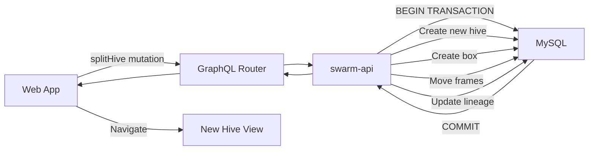

# Split Colony - Technical Documentation

### 🎯 Overview
Split Colony feature enables atomic migration of frames between hives with complete data preservation, lineage tracking, and optimized UI performance. Supports 1-10 frame selection with visual previews and automatic hive creation.

### 🏗️ Architecture

#### Components
- **SplitHiveModal**: Main React component handling split UI workflow
- **FramePreview**: Memoized component for frame thumbnails with selection
- **randomHiveName**: GraphQL query for name generation

#### Services
- **swarm-api**: Hive CRUD operations, frame migration logic, parent-child tracking
- **image-splitter**: Frame image storage and serving (no changes needed)
- **web-app**: Frontend React application with state management

### 📋 Technical Specifications

#### Database Schema
```sql
ALTER TABLE hives
  ADD COLUMN parent_hive_id INT UNSIGNED NULL,
  ADD COLUMN split_date DATETIME NULL,
  ADD INDEX idx_parent_hive_id (parent_hive_id);
```

#### GraphQL API
```graphql
mutation splitHive($sourceHiveId: ID!, $name: String!, $frameIds: [ID!]!) {
  splitHive(sourceHiveId: $sourceHiveId, name: $name, frameIds: $frameIds) {
    id
    name
    parentHive {
      id
      name
    }
    splitDate
  }
}

query randomHiveName($lang: String!) {
  randomHiveName(lang: $lang)
}

query getHive($hiveId: ID!) {
  hive(id: $hiveId) {
    id
    name
    parentHive {
      id
      name
      splitDate
    }
    childHives {
      id
      name
      splitDate
    }
  }
}
```

### 🔧 Implementation Details

#### Frontend
- **Framework**: React with TypeScript
- **State Management**: Local component state with useState
- **Optimization**: React.memo on FramePreview to prevent re-renders
- **Styling**: CSS with GPU-accelerated transforms for selection feedback
- **Image Loading**: Lazy loading with intersection observer

#### Backend
- **Language**: Go
- **Database**: MySQL with transactions for atomic operations
- **Data Migration**: 
  - Moves frames with `UPDATE frames SET box_id = ? WHERE id IN (?)`
  - Preserves frame sides (left_id, right_id foreign keys)
  - Reorders positions sequentially in target box
  - Updates parent_hive_id and split_date atomically

#### Data Flow


### ⚙️ Configuration
No special configuration required. Uses existing swarm-api database connection and image-splitter URLs.

### 🧪 Testing

#### Acceptance Criteria

**Frame Selection**
- Display all frames from all boxes grouped by box with clear headers
- Show left and right side thumbnail images for each frame
- Support selection of 1-10 frames minimum/maximum
- Visual feedback for selected frames (yellow highlight)
- Disable selection when 10 frames limit reached
- Frames ordered by position within each box (left to right)

**Hive Creation**
- Auto-generate new hive name using `randomHiveName` query
- Support multiple languages (en, ru, et, tr, pl, de, fr)
- Provide refresh button to regenerate name
- Create new hive in same apiary as source hive
- Create single deep box in new hive for selected frames

**Data Migration**
- Move selected frames to new hive's box atomically
- Preserve frame sides (left_id, right_id references)
- Maintain frame images in image-splitter service
- Keep all frame statistics (queen detection, bee counts, cell analysis)
- Reorder frame positions sequentially in target box (0, 1, 2, ...)
- Optionally inherit family reference from parent hive

**Lineage Tracking**
- Record parent hive ID in new hive (`parent_hive_id`)
- Record split date/time (`split_date`)
- Display "Split from [Parent Name] on [Date]" in child hive view
- Display "Child hives: [Child 1], [Child 2]..." in parent hive view
- Clickable links to navigate between parent and child hives

### 📊 Performance Considerations
- Checkbox selection responds instantly (under 100ms)
- No full re-render of all frames on selection (only clicked frame updates)
- Smooth visual transitions with GPU-accelerated CSS transforms
- Throttled clicks to prevent accidental double-selection
- Lazy-loaded frame images (only load visible frames)
- Database transaction ensures atomic operation (all or nothing)

### 🚫 Technical Limitations
- Cannot split to different apiary (same apiary only)
- No automatic frame recommendation based on brood pattern
- No undo operation (requires manual merge)
- No bulk split multiple hives simultaneously
- Manual queen tracking across splits required

### 🔗 Related Documentation
- [Join Colonies Technical Documentation](./join-colonies.md)
- [Hive Management](./hive-management.md)

### 📚 Development Resources
- [swarm-api Repository](https://github.com/Gratheon/swarm-api)
- [web-app Repository](https://github.com/Gratheon/web-app)
- [GraphQL Schema](https://github.com/Gratheon/graphql-schema-registry)

### 💬 Technical Notes
- Frame migration is atomic using database transactions to prevent data loss
- Image references in image-splitter remain unchanged (frames keep their left_id/right_id)
- UI optimization critical: React.memo prevents unnecessary re-renders of 20+ frame components
- Lineage tracking allows unlimited depth (splits can be split recursively)
- Auto-generated names use language-specific word lists maintained in swarm-api

---
**Last Updated**: December 5, 2025

