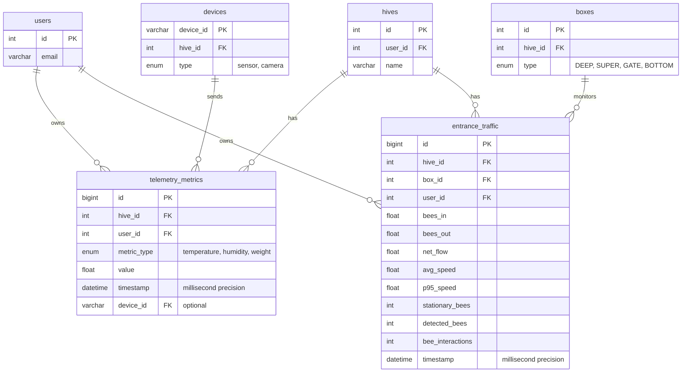
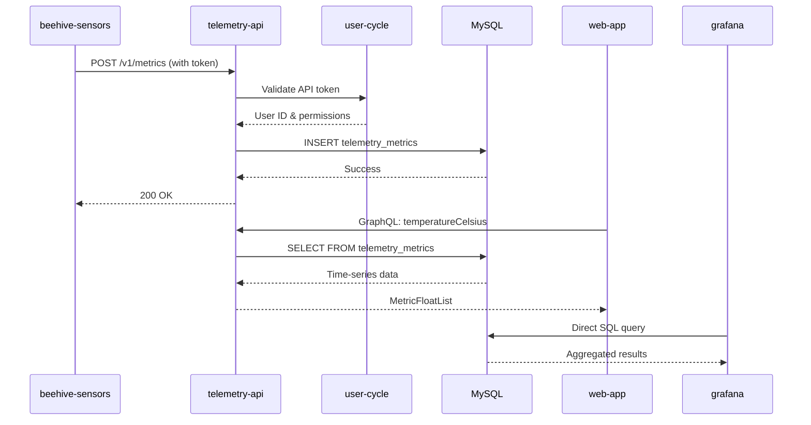

# Hive Telemetry Storage - Technical Documentation

### 🎯 Overview
Time-series data storage and querying system for IoT sensor metrics from beehives. Handles ingestion from multiple device types (temperature/humidity sensors, weight scales, entrance cameras) and provides GraphQL/REST APIs for data retrieval with flexible time-range queries and aggregation functions.

### 🏗️ Architecture

#### Components
- **TelemetryChart**: React component for rendering time-series graphs
- **MetricSelector**: UI for choosing which metrics to display
- **TimeRangeFilter**: Date range picker for historical queries
- **HiveTelemetryPanel**: Dashboard widget showing real-time sensor data
- **GrafanaEmbed**: iFrame integration for advanced analytics

#### Services
- **telemetry-api**: Core service for metric storage and retrieval
- **beehive-sensors**: Hardware device sending temperature, humidity, weight data
- **entrance-observer**: Video analytics service sending bee traffic metrics
- **user-cycle**: Authentication service for API token validation
- **graphql-router**: Federated gateway routing telemetry queries
- **grafana**: Advanced visualization and analytics platform

### 📋 Technical Specifications

#### Database Schema



**Table Design Rationale:**
- Separate tables for different metric categories (environmental vs entrance traffic)
- Millisecond precision timestamps for high-frequency data
- Composite indexes on (hive_id, timestamp DESC) for time-range queries
- Indexes on (user_id, hive_id) for data isolation
- Indexes on (metric_type, timestamp DESC) for filtered queries
- device_id tracks data source for debugging

#### GraphQL API
```graphql
scalar DateTime

enum AggregationType {
  DAILY_AVG
  DAILY_MAX
  DAILY_MIN
}

type TelemetryError {
  message: String
  code: String
}

type MetricFloat {
  t: DateTime!
  v: Float
}

type MetricFloatList {
  metrics: [MetricFloat]
}

union MetricListResult = MetricFloatList | TelemetryError

type BeeMovementInOutResult {
  beesIn: Float
  beesOut: Float
  netFlow: Float
  avgSpeed: Float
  p95Speed: Float
  stationaryBees: Int
  detectedBees: Int
  beeInteractions: Int
  time: DateTime
}

type EntranceMovementRecord {
  id: ID!
  hiveId: ID!
  boxId: ID!
  beesOut: Float
  beesIn: Float
  time: DateTime!
  netFlow: Float
  avgSpeed: Float
  p95Speed: Float
  stationaryBees: Int
  detectedBees: Int
  beeInteractions: Int
}

type EntranceMovementList {
  metrics: [EntranceMovementRecord]
}

union EntranceMovementResult = EntranceMovementList | TelemetryError

input MetricSetInput {
  temperatureCelsius: Float
  humidityPercent: Float
  weightKg: Float
}

type AddMetricMessage {
  message: String
}

union AddMetricResult = AddMetricMessage | TelemetryError

type Query {
  temperatureCelsius(
    hiveId: ID!
    timeRangeMin: Int
  ): MetricListResult
  
  humidityPercent(
    hiveId: ID!
    timeRangeMin: Int
  ): MetricListResult
  
  weightKg(
    hiveId: ID!
    timeRangeMin: Int
  ): MetricListResult
  
  weightKgAggregated(
    hiveId: ID!
    days: Int!
    aggregation: AggregationType
  ): MetricListResult
  
  entranceMovementToday(
    hiveId: ID!
    boxId: ID!
  ): BeeMovementInOutResult
  
  entranceMovement(
    hiveId: ID!
    boxId: ID
    timeFrom: DateTime!
    timeTo: DateTime!
  ): EntranceMovementResult
}

type Mutation {
  addMetric(
    hiveId: ID!
    fields: MetricSetInput!
  ): AddMetricResult
}
```

**Design Notes:**
- Short field names (t, v) in MetricFloat to reduce payload size
- Union types for error handling
- Flexible time range (minutes ago) vs absolute timestamps
- Aggregation at query time for flexibility

#### REST API Endpoints
```
POST /v1/metrics/:hiveId
Body: {
  "temperatureCelsius": 34.5,
  "humidityPercent": 65.2,
  "weightKg": 45.3
}
Headers: {
  "Authorization": "Bearer <user_api_token>"
}

POST /v1/entrance/:hiveId/:boxId
Body: {
  "beesIn": 12.5,
  "beesOut": 10.2,
  "netFlow": 2.3,
  "avgSpeed": 1.2,
  "p95Speed": 2.5,
  "stationaryBees": 5,
  "detectedBees": 18,
  "beeInteractions": 3
}
Headers: {
  "Authorization": "Bearer <device_token>"
}

GET /v1/metrics/:hiveId/temperature?from=2024-12-01&to=2024-12-06
GET /v1/metrics/:hiveId/humidity?minutes=60
GET /v1/metrics/:hiveId/weight?days=7&aggregation=DAILY_AVG
```

**REST Design:**
- Version prefix (/v1) for backwards compatibility
- Token-based authentication via user-cycle
- Support for both absolute timestamps and relative time ranges
- Bulk insert capability for batched sensor data

### 🔧 Implementation Details

#### Frontend (web-app)
- **Framework**: React 18 with TypeScript
- **Charting Library**: Lightweight Charts by TradingView
- **State Management**: Apollo Client for GraphQL caching
- **Real-time Updates**: Polling every 30 seconds for live data
- **Data Formatting**: Custom hooks for metric transformation

**Key Components:**
```typescript
interface TelemetryChartProps {
  hiveId: string;
  metricType: 'temperature' | 'humidity' | 'weight';
  timeRangeMinutes?: number;
  aggregation?: AggregationType;
}

const TelemetryChart: React.FC<TelemetryChartProps> = ({
  hiveId,
  metricType,
  timeRangeMinutes = 60,
  aggregation
}) => {
  const { data, loading, error } = useQuery(GET_METRIC_QUERY, {
    variables: { hiveId, timeRangeMin: timeRangeMinutes },
    pollInterval: 30000
  });
  
  return <LineChart data={data?.metrics} />;
};
```

#### Backend (telemetry-api)
- **Language**: Node.js with TypeScript
- **Framework**: Apollo Server for GraphQL
- **Database**: MySQL 8.0 with time-series optimizations
- **Authentication**: JWT token validation via user-cycle
- **Rate Limiting**: 100 req/min per device, 60 req/min per user

**Data Ingestion Flow:**
```typescript
async function addMetric(
  hiveId: number,
  userId: number,
  fields: MetricSetInput,
  deviceId?: string
): Promise<void> {
  const timestamp = new Date();
  const insertPromises = [];
  
  if (fields.temperatureCelsius !== undefined) {
    insertPromises.push(
      db.telemetry_metrics.insert({
        hive_id: hiveId,
        user_id: userId,
        metric_type: 'temperature',
        value: fields.temperatureCelsius,
        timestamp,
        device_id: deviceId
      })
    );
  }
  
  await Promise.all(insertPromises);
}
```

**Query Optimization:**
```typescript
async function getTemperature(
  hiveId: number,
  timeRangeMin: number = 60
): Promise<MetricFloat[]> {
  const fromTime = new Date(Date.now() - timeRangeMin * 60 * 1000);
  
  return db.query(`
    SELECT 
      timestamp as t,
      value as v
    FROM telemetry_metrics
    WHERE hive_id = ? 
      AND metric_type = 'temperature'
      AND timestamp >= ?
    ORDER BY timestamp ASC
    LIMIT 10000
  `, [hiveId, fromTime]);
}
```

**Aggregation Logic:**
```typescript
async function getWeightAggregated(
  hiveId: number,
  days: number,
  aggregation: AggregationType
): Promise<MetricFloat[]> {
  const aggFunc = {
    DAILY_AVG: 'AVG',
    DAILY_MAX: 'MAX',
    DAILY_MIN: 'MIN'
  }[aggregation];
  
  return db.query(`
    SELECT 
      DATE(timestamp) as t,
      ${aggFunc}(value) as v
    FROM telemetry_metrics
    WHERE hive_id = ?
      AND metric_type = 'weight'
      AND timestamp >= DATE_SUB(NOW(), INTERVAL ? DAY)
    GROUP BY DATE(timestamp)
    ORDER BY t ASC
  `, [hiveId, days]);
}
```

#### Data Flow


### ⚙️ Configuration

#### Environment Variables (telemetry-api)
```bash
MYSQL_HOST=localhost
MYSQL_PORT=3306
MYSQL_USER=telemetry
MYSQL_PASSWORD=secret
MYSQL_DATABASE=gratheon

USER_CYCLE_URL=http://user-cycle:8080
GRAPHQL_ROUTER_URL=http://graphql-router:8080

RATE_LIMIT_DEVICE=100
RATE_LIMIT_USER=60

DATA_RETENTION_DAYS_HOBBYIST=365
DATA_RETENTION_DAYS_STARTER=730
DATA_RETENTION_DAYS_PRO=1095
```

#### Device Configuration (beehive-sensors)
```ini
[telemetry]
api_endpoint=https://telemetry.gratheon.com/v1/metrics
api_token=your_api_token_here
hive_id=123
interval_seconds=5
batch_size=12
```

### 🧪 Testing

#### Unit Tests
Location: `/test/unit/`

**Coverage:**
- Metric ingestion validation (required fields, data types)
- Time range query logic (relative and absolute)
- Aggregation calculations (avg, min, max)
- Error handling (invalid hive IDs, unauthorized access)

```typescript
describe('TelemetryAPI', () => {
  describe('addMetric', () => {
    it('should insert temperature metric', async () => {
      const result = await addMetric(hiveId, userId, {
        temperatureCelsius: 34.5
      });
      expect(result).toBeDefined();
    });
    
    it('should reject invalid temperature values', async () => {
      await expect(
        addMetric(hiveId, userId, { temperatureCelsius: 150 })
      ).rejects.toThrow('Invalid temperature range');
    });
  });
});
```

#### Integration Tests
Location: `/test/integration/`

**Scenarios:**
- End-to-end data flow from device to database
- GraphQL query response format validation
- Token authentication with user-cycle
- Rate limiting enforcement
- Data retention policy execution

#### E2E Tests
Location: `web-app/e2e/telemetry.spec.ts`

**User Flows:**
- View real-time sensor data on hive dashboard
- Query historical data with time range selector
- Export telemetry data as CSV
- Set up threshold alerts based on metrics

### 📊 Performance Considerations

#### Optimizations
- **Database Indexes**: Composite indexes on (hive_id, timestamp) for fast range queries
- **Query Caching**: Apollo Server caching for frequently accessed time ranges (5 min TTL)
- **Connection Pooling**: MySQL connection pool (min: 10, max: 100)
- **Batch Inserts**: Group multiple metrics from same device into single transaction
- **Query Limits**: Maximum 10,000 data points per query to prevent memory issues
- **Aggregation**: Pre-calculate daily aggregates for long time ranges (over 30 days)

#### Bottlenecks
- **High-frequency writes**: Sensors send data every 5 seconds, approximately 17,280 inserts per hive per day
- **Large time-range queries**: Queries over 1 year require aggregation to avoid memory issues
- **Concurrent device writes**: MySQL write locks during bulk inserts from multiple devices
- **Grafana load**: Complex dashboard queries can generate 20+ database queries simultaneously

#### Metrics
- **Query response time**: under 500ms for 24-hour range, under 2 seconds for 30-day range
- **Write throughput**: over 1000 metrics per second across all devices
- **Database size**: approximately 500MB per hive per year (raw metrics)
- **Success rate**: over 99.5% (excluding network failures)
- **API availability**: over 99.9% uptime (monitored via health checks)

**Performance Monitoring:**
```typescript
interface PerformanceMetrics {
  queryDuration: number;
  dataPoints: number;
  cacheHit: boolean;
  dbConnectionTime: number;
}

async function logQueryPerformance(
  operation: string,
  metrics: PerformanceMetrics
) {
  if (metrics.queryDuration > 2000) {
    logger.warn('Slow query detected', { operation, metrics });
  }
}
```

### 🚫 Technical Limitations

**Current Constraints:**
- Maximum query range: 2 years without aggregation
- Data point limit per query: 10,000 records
- Write frequency: minimum 1 second interval per device
- Supported metrics: temperature, humidity, weight, entrance traffic only
- No real-time websocket streaming (polling only)
- Grafana requires separate authentication (not SSO integrated)

**Known Issues:**
- Daylight saving time transitions can create timestamp gaps in charts
- Device clock drift can cause out-of-order inserts
- MySQL date partitioning not yet implemented (planned for high-volume users)
- No automatic outlier detection or data smoothing
- Entrance traffic metrics require box_id (not hive-level aggregation)

**Future Improvements:**
- Add support for CO2, pressure, audio, vibration sensors
- Implement websocket subscriptions for real-time updates
- Add predictive analytics and anomaly detection
- Create automated report generation
- Implement data compression for older metrics (over 1 year)
- Add multi-hive aggregation queries for apiary-level analytics

### 🔗 Related Documentation
- [Hive Telemetry Storage (User Guide)](/about/products/web_app/pro-tier/hive_telemetry_storage)
- [Alert Management](/about/products/web_app/flexible-tier/alerts)
- [Colony Comparison Analytics](/about/products/web_app/pro-tier/colony_comparison_analytics)
- [GraphQL API Reference](/docs/API/GraphQL)
- [REST API Reference](/docs/API/REST)
- [Authentication Guide](/docs/API/Authentication)

### 📚 Development Resources
- **GitHub Repository**: [telemetry-api](https://github.com/Gratheon/telemetry-api)
- **Architecture Diagram**: Available in repository README
- **API Schema**: `/schema.graphql` in repository
- **Database Migrations**: `/migrations` directory
- **Grafana Dashboards**: `/grafana/dashboards` (JSON exports)

### 💬 Technical Notes

**Implementation Decisions:**
- Chose MySQL over InfluxDB/ClickHouse to reduce operational complexity (single database engine)
- REST API maintained for legacy device compatibility (new devices should use GraphQL)
- Polling instead of websockets for simpler scaling and lower server resource usage
- Separate table for entrance traffic due to different schema (multiple metrics per timestamp)
- Short field names (t, v) in GraphQL responses to optimize mobile data usage

**Integration Considerations:**
- Devices must handle network interruptions gracefully (buffer and retry)
- API tokens should be rotated every 90 days for security
- Large time-range queries should use aggregation to prevent timeout
- Grafana embedding requires CORS configuration on telemetry-api
- Data retention policies executed daily via cron job (deletes old records)

---
## Change Log

**Last Updated**: December 6, 2025

