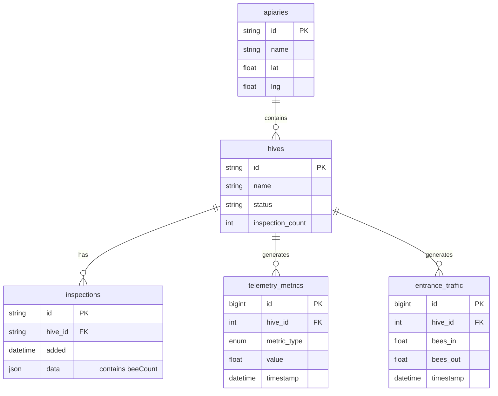

# Timeseries Data Analytics - Technical Documentation

### 🎯 Overview
Interactive telemetry data visualization system built with React and lightweight-charts, available in two modes: individual hive view (7-day recent metrics under hive "Metrics" tab) and multi-hive analytics dashboard (`/time` page) for cross-colony comparison. Enables real-time visualization of telemetry data, inspection records, and environmental metrics with synchronized time-axis navigation and data export capabilities.

### 🏗️ Architecture

#### Components

**Individual Hive View** (`/apiaries/:id/hives/:id` - Metrics tab):
- **HiveWeightGraph**: Container component for single hive metrics
- **WeightChart**: 7-day weight data for individual hive
- **TemperatureChart**: 7-day temperature data for individual hive
- **EntranceMovementChart**: 7-day entrance traffic for individual hive

**Multi-Hive Analytics** (`/time` page):
- **TimeView**: Main container component managing state and data fetching
- **ChartContainer**: Reusable wrapper for all chart types with export and alert features
- **PopulationChart**: Bee population estimates from inspections with ideal curve overlay
- **MultiHiveWeightChart**: Daily average weight comparison across hives
- **MultiHiveTemperatureChart**: Internal temperature monitoring
- **MultiHiveEntranceChart**: Entrance traffic flow analysis
- **MultiHiveEntranceSpeedChart**: Bee movement velocity tracking
- **MultiHiveEntranceDetectedChart**: Total bee count detection
- **MultiHiveEntranceStationaryChart**: Guard bee behavior monitoring
- **MultiHiveEntranceInteractionsChart**: Bee-to-bee interaction analysis
- **WeatherSection**: Environmental data correlation widgets
- **ApiarySelector**: Dropdown for apiary filtering
- **HiveSelector**: Multi-select checkbox list for hive filtering
- **TimeRangeSelector**: Radio buttons for time range selection
- **ChartToggles**: Checkbox toggles for enabling/disabling charts

#### Services
- **telemetry-api**: GraphQL queries for weight, temperature, entrance metrics
- **web-app local Dexie DB**: IndexedDB storage for hives and inspections
- **graphql-router**: Federated gateway for telemetry queries
- **weather services**: External APIs for environmental data

### 📋 Technical Specifications

#### Database Schema



#### GraphQL API

**Individual Hive View Query:**
```graphql
query hiveWeight(
  $hiveId: ID!
  $timeRangeMin: Int
  $timeFrom: DateTime!
  $timeTo: DateTime!
) {
  weightKg(hiveId: $hiveId, timeRangeMin: $timeRangeMin) {
    ... on MetricFloatList {
      metrics {
        t
        v
      }
    }
    ... on TelemetryError {
      message
      code
    }
  }
  
  temperatureCelsius(hiveId: $hiveId, timeRangeMin: $timeRangeMin) {
    ... on MetricFloatList {
      metrics {
        t
        v
      }
    }
    ... on TelemetryError {
      message
      code
    }
  }
  
  entranceMovement(hiveId: $hiveId, timeFrom: $timeFrom, timeTo: $timeTo) {
    ... on EntranceMovementList {
      metrics {
        time
        beesIn
        beesOut
        netFlow
      }
    }
    ... on TelemetryError {
      message
      code
    }
  }
}
```

**Multi-Hive Analytics Query:**
```graphql
query MultiHiveTelemetry(
  $days: Int!
  $temperatureTimeRangeMin: Int!
  $timeFrom: DateTime!
  $timeTo: DateTime!
) {
  weightKgAggregated(
    hiveId: "123"
    days: $days
    aggregation: DAILY_AVG
  ) {
    ... on MetricFloatList {
      metrics {
        t
        v
      }
    }
    ... on TelemetryError {
      message
      code
    }
  }
  
  temperatureCelsius(
    hiveId: "123"
    timeRangeMin: $temperatureTimeRangeMin
  ) {
    ... on MetricFloatList {
      metrics {
        t
        v
      }
    }
  }
  
  entranceMovement(
    hiveId: "123"
    timeFrom: $timeFrom
    timeTo: $timeTo
  ) {
    ... on EntranceMovementList {
      metrics {
        time
        beesIn
        beesOut
        netFlow
        avgSpeed
        p95Speed
        stationaryBees
        detectedBees
        beeInteractions
      }
    }
  }
}

query HIVES {
  apiaries {
    id
    name
    lat
    lng
    hives {
      id
      name
      status
      inspectionCount
      family {
        id
      }
    }
  }
}
```

**Query Construction:**
- Dynamically generates GraphQL query based on selected hives
- Separate aliases for each hive (e.g., `hive_123_weight`, `hive_456_weight`)
- Union types handle errors gracefully
- Variables control time ranges and aggregation

#### Local Storage Schema

```typescript
interface LocalStorageKeys {
  'timeView.selectedApiaryId': string | null
  'timeView.selectedHiveIds': string[]
  'timeView.enabledCharts': {
    population: boolean
    weight: boolean
    temperature: boolean
    entrance: boolean
    entranceSpeed: boolean
    entranceDetected: boolean
    entranceStationary: boolean
    entranceInteractions: boolean
    weather: boolean
    weatherTemperature: boolean
    wind: boolean
    rain: boolean
    solarRadiation: boolean
    cloudCover: boolean
    pollen: boolean
    pollution: boolean
  }
  'timeView.showIdealCurve': boolean
}
```

### 🔧 Implementation Details

#### Frontend (web-app)
- **Framework**: React 18 with TypeScript
- **Routing**: react-router-dom v6 with URL query parameters
- **State Management**: React hooks (useState, useMemo, useEffect, useRef)
- **Data Fetching**: Apollo Client GraphQL with Dexie.js for local IndexedDB
- **Charting**: lightweight-charts (TradingView library)
- **Styling**: CSS Modules with LESS preprocessor

**State Management:**
```typescript
const [selectedApiaryId, setSelectedApiaryId] = useState<string | null>()
const [selectedHiveIds, setSelectedHiveIds] = useState<string[]>([])
const [timeRangeDays, setTimeRangeDays] = useState(90)
const [showIdealCurve, setShowIdealCurve] = useState(true)
const [enabledCharts, setEnabledCharts] = useState({...})
```

**Data Flow (Individual Hive View):**
1. User navigates to hive details page
2. Clicks "Metrics" tab in hive navigation
3. Fixed 7-day query fetches weight, temperature, entrance data
4. Three charts render with synchronized time axis
5. Charts auto-refresh every 30 seconds

**Data Flow (Multi-Hive Analytics):**
1. Fetch apiaries and hives from GraphQL
2. Store hives in local Dexie DB for offline access
3. User selects apiary → filters hives
4. User selects hives → triggers telemetry query
5. Dynamic GraphQL query fetches all metrics for selected hives
6. Data transformed and passed to chart components
7. Charts render with synchronized time axis

**URL Query Parameters:**
- `?hiveId=123` - Auto-select hive and scroll to view
- `?apiaryId=456` - Pre-select apiary
- `?chartType=weight` - Enable specific chart type
- `?scrollTo=weight` - Scroll to specific chart section

**Chart Synchronization:**
```typescript
const { chartRefs, syncCharts } = useChartSync()

const syncCharts = (sourceChart: any) => {
  const timeRange = sourceChart.timeScale().getVisibleLogicalRange()
  chartRefs.current.forEach(chart => {
    if (chart !== sourceChart) {
      chart.timeScale().setVisibleLogicalRange(timeRange)
    }
  })
}
```

**Data Export:**
```typescript
const exportToCSV = () => {
  const headers = ['Timestamp', ...hiveNames]
  const rows = dataPoints.map(point => [
    point.time,
    ...point.values
  ])
  const csv = [headers, ...rows]
    .map(row => row.join(','))
    .join('\n')
  
  const blob = new Blob([csv], { type: 'text/csv' })
  const url = URL.createObjectURL(blob)
  const a = document.createElement('a')
  a.href = url
  a.download = `${title}_${timestamp}.csv`
  a.click()
}
```

#### Backend Integration
- **telemetry-api**: Provides weight, temperature, entrance metrics
- **Dexie.js**: Client-side IndexedDB for hives and inspections
- **Apollo Client**: GraphQL client with caching and polling
- **LocalStorage**: Persists user preferences and chart settings

**Dexie Schema:**
```typescript
class HiveDatabase extends Dexie {
  hives: Table<Hive, string>
  inspections: Table<Inspection, string>
  
  constructor() {
    super('HiveDatabase')
    this.version(1).stores({
      hives: 'id, name, status',
      inspections: 'id, hive_id, added'
    })
  }
}
```

**GraphQL Query Construction:**
```typescript
const telemetryQueryString = useMemo(() => {
  if (!activeHives.length) return null
  
  const queries = activeHives.map(hive => `
    hive_${hive.id}_weight: weightKgAggregated(
      hiveId: "${hive.id}"
      days: $days
      aggregation: DAILY_AVG
    ) {
      ... on MetricFloatList {
        metrics { t v }
      }
    }
  `).join('\n')
  
  return gql`
    query MultiHiveTelemetry($days: Int!, ...) {
      ${queries}
    }
  `
}, [activeHives])
```

#### Data Transformation

**Weight Data:**
```typescript
const weightDataByHive = useMemo(() => {
  const result = {}
  activeHives.forEach(hive => {
    result[hive.id] = {
      hiveName: hive.name,
      data: telemetryData[`hive_${hive.id}_weight`]?.metrics || []
    }
  })
  return result
}, [telemetryData, activeHives])
```

**Population Data:**
```typescript
const inspectionsByHive = useMemo(() => {
  const grouped = {}
  inspections.forEach(ins => {
    const population = JSON.parse(ins.data || '{}')?.hive?.beeCount
    if (!grouped[ins.hiveId]) grouped[ins.hiveId] = []
    grouped[ins.hiveId].push({
      date: new Date(ins.added),
      population
    })
  })
  
  Object.keys(grouped).forEach(hiveId => {
    grouped[hiveId].sort((a, b) => a.date.getTime() - b.date.getTime())
  })
  
  return grouped
}, [inspections])
```

### ⚙️ Configuration

#### Environment Variables
```bash
REACT_APP_GRAPHQL_URL=http://graphql-router:8080
REACT_APP_TELEMETRY_API_URL=http://telemetry-api:8600
```

#### Chart Options
```typescript
const defaultChartOptions = {
  layout: {
    attributionLogo: false,
    background: { color: '#FFFFFF' },
    textColor: '#333'
  },
  timeScale: {
    timeVisible: true,
    secondsVisible: false,
    fixLeftEdge: true,
    fixRightEdge: true
  },
  grid: {
    vertLines: { color: '#e1e1e1' },
    horzLines: { color: '#e1e1e1' }
  },
  crosshair: {
    mode: 1
  }
}
```

### 🧪 Testing

#### Unit Tests
Location: `/test/page/time/`

**Coverage:**
- State management (apiary selection, hive filtering, time range)
- LocalStorage persistence
- URL parameter parsing
- Data transformation logic
- Chart toggle functionality

#### Integration Tests
Location: `/test/integration/time/`

**Scenarios:**
- Load page with URL parameters
- Select apiary and verify hive list updates
- Toggle multiple hives and verify query changes
- Change time range and verify data refetch
- Export chart data as CSV
- Synchronized chart zooming and panning

#### E2E Tests
Location: `e2e/timeseries-analytics.spec.ts`

**User Flows:**
- Navigate to /time page
- Select specific apiary from dropdown
- Choose multiple hives for comparison
- Adjust time range slider
- Enable/disable specific charts
- Export weight data as CSV
- Share view via URL with parameters

### 📊 Performance Considerations

#### Optimizations
- **Memoization**: useMemo for expensive data transformations
- **Dynamic queries**: Only fetch data for selected hives
- **Aggregation**: Daily averages for ranges over 30 days
- **Lazy loading**: Charts only render when enabled
- **IndexedDB caching**: Hives and inspections cached locally
- **Apollo caching**: GraphQL responses cached with TTL
- **Chart reuse**: lightweight-charts instances pooled

#### Bottlenecks
- **Large time ranges**: Fetching 365 days of high-resolution data (10K+ points)
- **Many hives**: Comparing over 10 hives simultaneously generates complex queries
- **Chart rendering**: Simultaneous rendering of 8+ charts on page load
- **Entrance data volume**: Entrance metrics updated every second (86K points per day)

#### Metrics
- **Initial page load**: under 2 seconds with cached data
- **Time range change**: under 1 second for 90-day query
- **Chart zoom/pan**: 60fps smooth scrolling with sync
- **CSV export**: under 500ms for 10K data points
- **Memory usage**: under 200MB with 5 hives, 90 days, all charts

**Performance Monitoring:**
```typescript
useEffect(() => {
  const startTime = performance.now()
  
  if (telemetryData) {
    const endTime = performance.now()
    console.log(`Data loaded in ${endTime - startTime}ms`)
  }
}, [telemetryData])
```

### 🚫 Technical Limitations

**Current Constraints:**
- Maximum 10 hives compared simultaneously (query complexity limit)
- Temperature limited to 7 days (7 * 24 * 60 = 10,080 minutes max)
- No real-time streaming (polling every 30 seconds)
- Chart export limited to visible data points
- No custom aggregation functions (only AVG, MIN, MAX)
- Weather data requires apiary GPS coordinates
- Population curve requires manual inspection data entry
- Entrance metrics require hardware (entrance-observer)

**Known Issues:**
- Chart synchronization can lag with over 6 charts enabled
- Large CSV exports (over 50K rows) may freeze browser briefly
- URL parameter parsing doesn't validate hive ownership
- LocalStorage quota exceeded on older browsers (5MB limit)
- Timezone handling uses browser local time (not UTC)

**Future Improvements:**
- Add websocket subscriptions for real-time updates
- Implement server-side chart image rendering for reports
- Add custom aggregation functions (median, percentiles)
- Support PDF export with multi-page layouts
- Add statistical overlays (moving averages, trend lines)
- Implement chart annotations for marking events
- Add comparison mode (this year vs last year)
- Support multi-apiary aggregation for commercial beekeepers

### 🔗 Related Documentation
- [Timeseries Data Analytics (User Guide)](/about/products/web_app/pro-tier/timeseries_data_analytics)
- [Hive Telemetry Storage](/about/products/web_app/pro-tier/hive_telemetry_storage)
- [Colony Comparison Analytics](/about/products/web_app/pro-tier/colony_comparison_analytics)
- [Telemetry API](/docs/web-app/features/telemetry-storage)

### 📚 Development Resources
- **GitHub Repository**: [web-app](https://github.com/Gratheon/web-app)
- **Charts Library**: [lightweight-charts](https://tradingview.github.io/lightweight-charts/)
- **Dexie.js Docs**: [dexie.org](https://dexie.org/)
- **Apollo Client**: [apollographql.com](https://www.apollographql.com/docs/react/)

### 💬 Technical Notes

**Implementation Decisions:**
- Two separate views: quick hive metrics (7 days) vs comprehensive multi-hive analytics
- Chose lightweight-charts over Chart.js for better performance with large datasets
- Used IndexedDB (Dexie) instead of Redux for offline-first architecture
- Dynamic GraphQL queries avoid overfetching data for unselected hives
- LocalStorage for preferences balances persistence with privacy
- URL parameters enable shareable deep links to specific views
- Chart synchronization uses pub-sub pattern for loose coupling
- Individual hive view uses fixed 7-day range for simplicity and performance

**Integration Considerations:**
- Hive list must be synced from GraphQL to local DB on initial load
- Temperature query limited to 7 days to prevent memory issues
- Chart refs array must be cleaned up to prevent memory leaks
- CSV export uses Blob URLs that must be revoked after download
- Alert thresholds fetched separately and overlaid on charts
- Weather data requires external API keys configured in backend

**Chart Customization:**
- Each chart type extends base ChartContainer component
- Color schemes consistent with brand guidelines
- Tooltip formatters handle different unit types (kg, °C, count)
- Legend positioning avoids overlapping with data lines
- Grid lines use subtle colors to reduce visual noise

---
## Change Log

**Last Updated**: December 6, 2025

