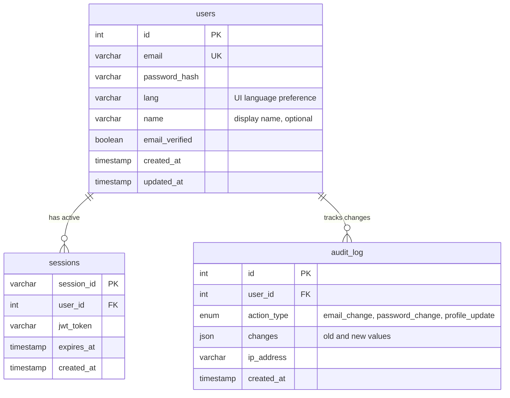
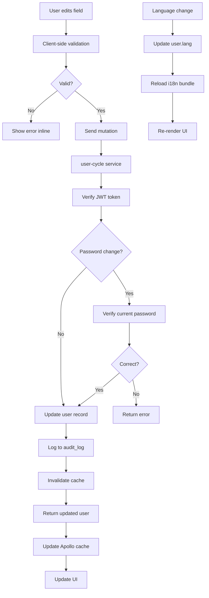

# User Profile Editing - Technical Documentation

### 🎯 Overview
User account settings management system allowing authenticated users to update profile information, change passwords, switch language preferences, and manage account preferences. Integrates with authentication and localization systems for immediate effect.

### 🏗️ Architecture

#### Components
- **AccountSettingsForm**: React form component for profile editing
- **PasswordChangeModal**: Separate modal for secure password updates
- **LanguageSwitcher**: Dropdown for language selection with immediate UI update
- **SettingsPanel**: Container organizing all account settings

#### Services
- **user-cycle**: Primary service handling user profile updates and authentication
- **graphql-router**: Federated gateway routing user mutations
- **redis**: Session management and cache invalidation

### 📋 Technical Specifications

#### Database Schema


#### GraphQL API
```graphql
type User {
  id: ID!
  email: String!
  name: String
  lang: String!
  emailVerified: Boolean!
  createdAt: DateTime!
  updatedAt: DateTime!
}

input UpdateProfileInput {
  name: String
  email: String
  lang: String
}

input ChangePasswordInput {
  currentPassword: String!
  newPassword: String!
}

type Mutation {
  updateProfile(input: UpdateProfileInput!): User!
  changePassword(input: ChangePasswordInput!): Boolean!
  updateLanguage(lang: String!): User!
}

type Query {
  me: User
  accountSettings: User
}
```

### 🔧 Implementation Details

#### Frontend
- **Framework**: React with TypeScript
- **Forms**: React Hook Form with yup validation
- **State Management**: Apollo Client cache with optimistic updates
- **Language Switch**: Updates localStorage + triggers i18n reload
- **Password Strength**: zxcvbn library for real-time feedback

#### Backend (user-cycle)
- **Language**: Go
- **Framework**: Custom HTTP server with GraphQL resolver
- **Validation**: Email format, password strength (min 8 chars)
- **Security**: Current password verification for password changes
- **Audit**: Log all profile changes to audit_log table

#### Data Flow


### ⚙️ Configuration

**Environment Variables (user-cycle)**
```bash
MYSQL_HOST=localhost
MYSQL_PORT=3306
MYSQL_DATABASE=users
MYSQL_USER=user_cycle
MYSQL_PASSWORD=<secret>

JWT_SECRET=<secret>
JWT_EXPIRY=30d

BCRYPT_COST=12
PASSWORD_MIN_LENGTH=8

REDIS_HOST=localhost:6379
REDIS_PASSWORD=<secret>

ALLOWED_LANGUAGES=en,ru,uk,et,de,fr,es
```

### 🧪 Testing

#### Unit Tests
- Email format validation
- Password strength requirements
- Language code validation
- Current password verification
- Audit log creation

#### Integration Tests
- Full profile update flow
- Password change with JWT refresh
- Language change triggers cache update
- Email uniqueness enforcement
- Concurrent update handling

#### E2E Tests
- User updates name and saves
- User changes password successfully
- User switches language, UI updates
- Invalid current password rejection
- Email conflict handling

### 📊 Performance Considerations

#### Optimizations
- Optimistic UI updates for instant feedback
- Debounced form validation (300ms)
- Partial updates (only changed fields sent)
- Redis cache for user profile (TTL: 1 hour)
- Database indexes on email and id

#### Metrics
- Profile update API response: under 200ms
- Password change response: under 500ms (bcrypt hashing)
- Language switch response: under 100ms
- Cache hit rate: over 80%
- Form validation: under 50ms

### 🔒 Security Considerations

#### Password Changes
- Requires current password verification
- New password must differ from current
- Bcrypt hashing with cost factor 12
- Automatic session refresh on password change
- Email notification sent on password change

#### Email Changes
- Email uniqueness enforced at DB level
- Case-insensitive comparison
- Optional: Email verification for new address (not yet implemented)
- Audit log records old and new email

#### Input Validation
- Email: RFC 5322 compliant
- Password: Minimum 8 characters, no maximum
- Language: Must be in ALLOWED_LANGUAGES list
- Name: Max 100 characters, alphanumeric + spaces

#### Audit Trail
- All profile changes logged with timestamp
- IP address recorded for security review
- Changes stored as JSON (old vs new values)
- Retained for 2 years

### 🚫 Technical Limitations
- No profile picture upload (planned feature)
- No two-factor authentication setup (separate feature)
- Email changes don't require verification yet (security gap)
- No bulk profile updates
- Session invalidation on password change affects all devices (by design)

### 🔗 Related Documentation
- [User Registration Technical Documentation](./user-registration.md)

### 📚 Development Resources
- [user-cycle repository](https://github.com/Gratheon/user-cycle)
- [GraphQL schema](https://github.com/Gratheon/graphql-schema-registry)
- [Account settings UI](https://github.com/Gratheon/web-app/src/components/AccountSettings)

### 💬 Technical Notes
- Consider adding email verification flow for email changes (security improvement)
- May want to add "delete account" link in settings (separate feature)
- Language switch is instant but requires page reload for some static content
- Password strength meter helps users create secure passwords
- Audit log grows over time - consider archiving strategy after 2 years

---
**Last Updated**: December 5, 2025
**Maintained By**: Backend Team

