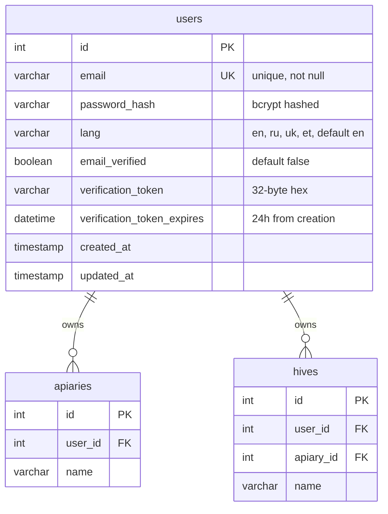
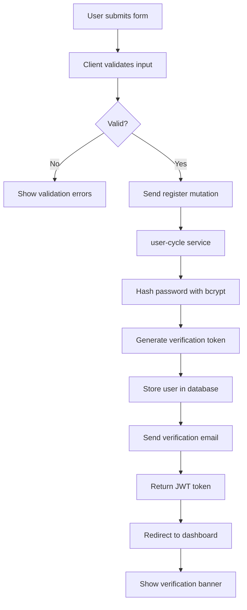
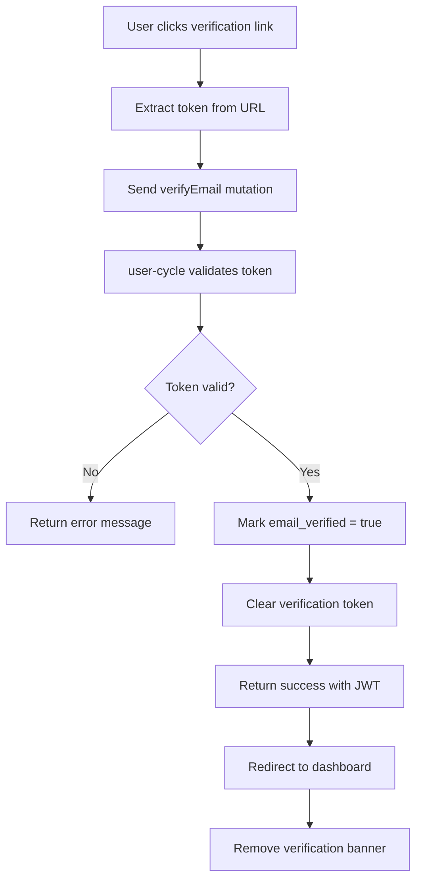

# User Registration - Technical Documentation

### 🎯 Overview
Email-based user registration system with automatic language detection, email verification workflow, and secure password hashing. Foundation for user authentication and personalized experience across the platform.

### 🏗️ Architecture

#### Components
- **RegistrationForm**: React form component with client-side validation
- **EmailVerificationBanner**: UI component prompting users to verify email
- **LanguageDetector**: Browser language detection utility

#### Services
- **user-cycle**: Primary service handling user authentication and profile management
- **graphql-router**: Federated gateway routing registration mutations
- **email-service**: SMTP service for sending verification emails (via user-cycle)

### 📋 Technical Specifications

#### Database Schema


#### GraphQL API
```graphql
type User {
  id: ID!
  email: String!
  lang: String
  emailVerified: Boolean!
  createdAt: DateTime!
}

type AuthPayload {
  token: String!
  user: User!
}

type Mutation {
  register(email: String!, password: String!, lang: String): AuthPayload!
  verifyEmail(token: String!): AuthPayload!
  resendVerificationEmail(email: String!): Boolean!
}

input RegisterInput {
  email: String!
  password: String!
  lang: String
}
```

### 🔧 Implementation Details

#### Frontend
- **Framework**: React with TypeScript
- **Validation**: Client-side email format and password strength checks
- **Language Detection**: `navigator.language` or `navigator.languages[0]`
- **State Management**: Local component state for form handling
- **Error Handling**: Display validation errors and API errors inline

#### Backend (user-cycle)
- **Language**: Go
- **Password Hashing**: bcrypt with cost factor 12
- **Token Generation**: Cryptographically secure random tokens (32 bytes, hex encoded)
- **Email Service**: SMTP integration for verification emails
- **Token Expiry**: 24 hours for verification tokens

#### Registration Flow


#### Email Verification Flow


### ⚙️ Configuration

**Environment Variables (user-cycle)**
```bash
SMTP_HOST=smtp.gmail.com
SMTP_PORT=587
SMTP_USER=noreply@gratheon.com
SMTP_PASSWORD=<secret>
SMTP_FROM=Gratheon <noreply@gratheon.com>
VERIFICATION_URL_BASE=https://app.gratheon.com/verify
JWT_SECRET=<secret>
BCRYPT_COST=12
```

### 🧪 Testing

#### Unit Tests
- Password hashing and validation
- Token generation and validation
- Language detection logic
- Email validation regex

#### Integration Tests
- Full registration flow
- Email verification workflow
- Duplicate email handling
- Token expiry validation

#### E2E Tests
- User completes registration form
- Receives and clicks verification email
- Successfully logs in after verification

### 📊 Performance Considerations

#### Optimizations
- Async email sending (non-blocking)
- Database indexes on email and verification_token
- Client-side validation before API calls
- JWT token caching in localStorage

#### Metrics
- Registration API response: under 500ms (excluding email send)
- Email delivery: under 30 seconds
- Password hashing time: under 200ms
- Form validation: under 50ms

### 🔒 Security Considerations

#### Password Security
- Minimum 8 characters enforced
- bcrypt hashing with cost factor 12
- No password complexity requirements (length is more important)
- Passwords never logged or stored in plain text

#### Email Verification
- Cryptographically secure random tokens
- Tokens expire after 24 hours
- Tokens are single-use (cleared after verification)
- Rate limiting on resend requests (1 per 5 minutes)

#### Account Security
- Email uniqueness enforced at database level
- Case-insensitive email comparison
- Protection against user enumeration (generic error messages)
- HTTPS required for all registration endpoints

### 🚫 Technical Limitations
- No OAuth/SSO integration (Google, Facebook, etc.)
- No phone number verification option
- Email sending depends on external SMTP service availability
- Language detection limited to browser-reported languages
- No CAPTCHA or bot protection (may add if spam becomes issue)

### 🔗 Related Documentation
- [User Profile Editing Technical Documentation](./user-profile-editing.md)

### 📚 Development Resources
- [user-cycle repository](https://github.com/Gratheon/user-cycle)
- [GraphQL schema](https://github.com/Gratheon/graphql-schema-registry)
- [Registration flow diagram](https://www.notion.so/User-registration-password-restoration-48f81c4ccbc748ceadf618b28eda9a39)

### 💬 Technical Notes
- Consider adding OAuth providers in future for faster onboarding
- Email delivery rate currently around 98% (monitor bounce rates)
- Language detection accuracy depends on browser settings (consider IP-based fallback)
- JWT tokens valid for 30 days, refresh mechanism may be needed for long-term sessions

---
**Last Updated**: December 5, 2025
**Maintained By**: Backend Team

