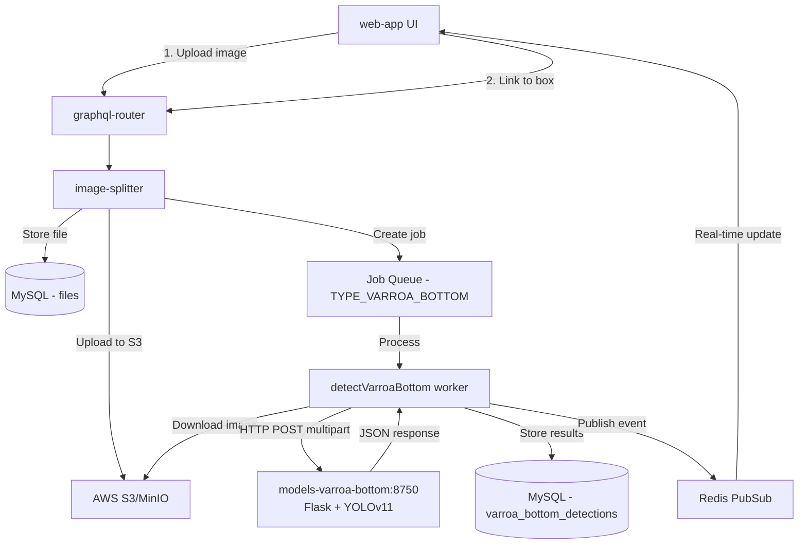
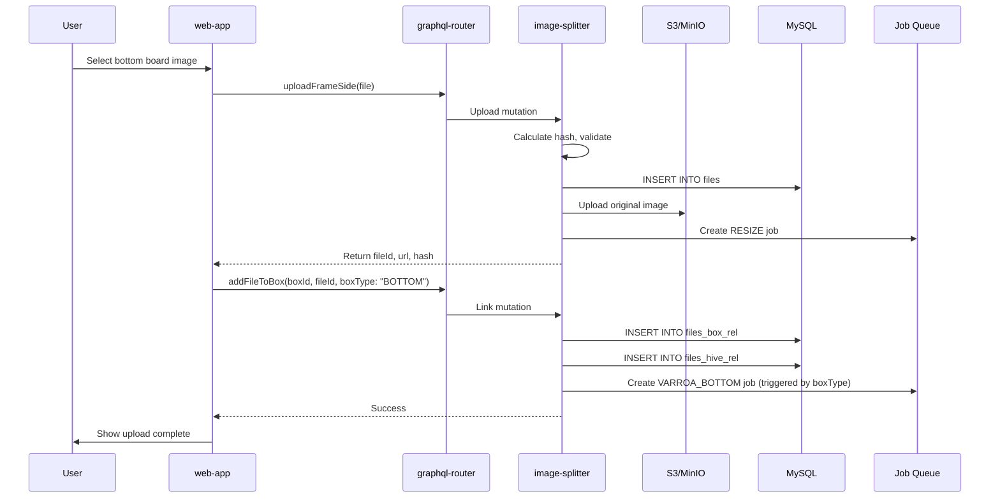
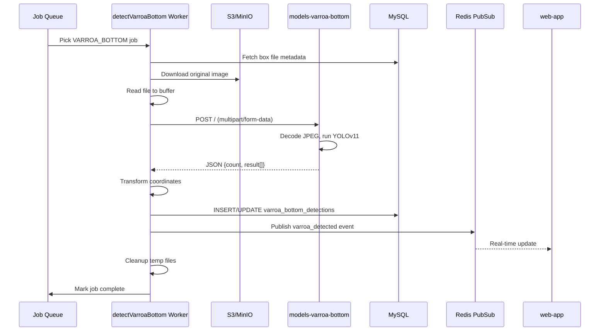
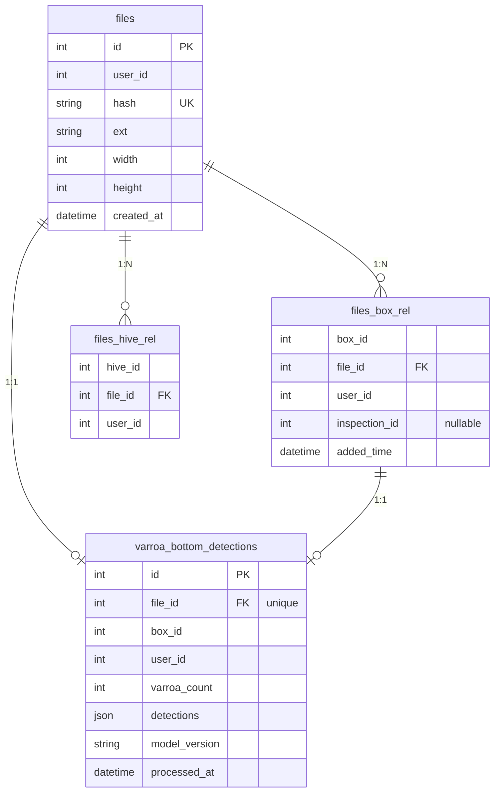

# Varroa Bottom Board Detection - Technical Documentation

### 🎯 Overview
This feature enables varroa mite detection from hive bottom board images using AI/ML models. Bottom boards (white sticky sheets placed at the hive floor) collect fallen varroa mites, which are then counted from uploaded photos. Unlike frame-based varroa detection that uses Clarifai API, bottom board detection calls a self-hosted YOLOv11 model service.

**Status:** ✅ **Implemented** (December 2024)

### 🏗️ Architecture

#### System Overview


#### Components

**Frontend (web-app)**
- `src/page/hiveEdit/bottomBox/BottomBox.tsx` - Upload UI component with file selection
- `src/page/hiveEdit/index.tsx` - Hive structure integration showing bottom board
- GraphQL mutations: `uploadFrameSide`, `addFileToBox`

**Backend Services**
- **image-splitter** (TypeScript/Node.js) - Image upload, storage, varroa detection orchestration
  - Worker: `src/workers/detectVarroaBottom.ts` - Downloads image, calls model API, stores results
  - Model: `src/models/boxFile.ts` - Database operations for box files and detections
  - Config: `src/config/config.dev.ts`, `src/config/config.default.ts` - Model URL configuration
  
- **models-varroa-bottom** (Python/Flask) - YOLOv11 inference server
  - `server_flask.py` - Flask HTTP server handling multipart/form-data uploads
  - `detect.py` - YOLOv11 model inference wrapper
  - Model: YOLOv11-nano trained on varroa mite images (best.pt)
  - Port: 8750
  
- **graphql-router** - API gateway routing GraphQL queries/mutations

**Infrastructure**
- AWS S3/MinIO - Image storage (original + resized versions: 1024px, 512px, 128px)
- MySQL - Metadata, box relations, and detection results
- Redis - Job queue and pub/sub for real-time updates

### 📋 Technical Specifications

#### Database Schema

**Key Tables (image-splitter database):**

**files** - Uploaded image metadata
- Primary key: `id`, Unique: `(user_id, hash)`
- Stores: hash, extension, dimensions, upload timestamp

**files_box_rel** - Links files to bottom boxes
- Composite key: `(file_id, box_id, user_id)`
- Supports inspection versioning via nullable `inspection_id`

**varroa_bottom_detections** - AI detection results
- Primary key: `id`, Unique: `file_id` (one detection per file)
- Stores: varroa_count, detections JSON, model_version, processed timestamp
- Indexed by: `(user_id, box_id)` for fast queries

**jobs** - Async task queue
- Supports retry logic with `calls` counter
- Indexed by: `(name, process_start_time, process_end_time, calls)`

**Migrations:**
- `018-box-files.sql` - files_box_rel table
- `020-varroa-bottom-detections.sql` - varroa_bottom_detections table
- `017-jobs.sql` - jobs table

**Detection JSON format (normalized 0-1 range):**
```json
[
  {
    "x": 0.5586,
    "y": 0.6187,
    "w": 0.0157,
    "c": 0.92
  },
  {
    "x": 0.2741,
    "y": 0.2944,
    "w": 0.0152,
    "c": 0.88
  }
]
```
- Coordinates are normalized to 0-1 range relative to original image dimensions
- `x`, `y` = center position (4 decimal precision)
- `w` = width as fraction of image width (4 decimal precision)  
- `c` = confidence score (2 decimal precision)

#### GraphQL API

**Mutations:**
```graphql
# Upload image file (returns fileId) - used for ALL image uploads including bottom boards
mutation uploadFrameSide($file: Upload!) {
  uploadFrameSide(file: $file) {
    id
    url
    hash
    resizes {
      id
      url
      max_dimension_px
    }
  }
}

# Link uploaded file to bottom box (triggers varroa detection job)
mutation addFileToBox($boxId: ID!, $fileId: ID!, $hiveId: ID!, $boxType: String) {
  addFileToBox(boxId: $boxId, fileId: $fileId, hiveId: $hiveId, boxType: $boxType)
}
```

**Query:**
```graphql
# Get bottom box files with varroa detection results
query varroaBottomDetections($boxId: ID!, $inspectionId: ID) {
  varroaBottomDetections(boxId: $boxId, inspectionId: $inspectionId) {
    id
    fileId
    boxId
    varroaCount
    detections
    processedAt
  }
}

# Get box files
query boxFiles($boxId: ID!, $inspectionId: ID) {
  boxFiles(boxId: $boxId, inspectionId: $inspectionId) {
    fileId
    userId
    boxId
    file {
      id
      url
      hash
      ext
    }
    addedTime
  }
}
```

**Subscriptions (Real-time Updates):**
```graphql
# Subscribe to varroa detection completion events
subscription onBoxVarroaDetected($boxId: String) {
  onBoxVarroaDetected(boxId: $boxId) {
    fileId
    boxId
    varroaCount
    detections
    isComplete
  }
}
```

**Subscription Flow:**
1. Worker publishes to Redis channel: `{userId}.box.{boxId}.varroa_detected`
2. event-stream-filter forwards to GraphQL WebSocket subscription
3. web-app receives real-time update and refetches detection data
4. UI updates to show detection results without page reload

**Implementation:**
- event-stream-filter: `src/index.ts` - `onBoxVarroaDetected` resolver
- web-app: `src/page/hiveEdit/bottomBox/BottomBox.tsx` - `useSubscription` hook
- image-splitter: `src/workers/detectVarroaBottom.ts` - publishes event after detection complete

**Implementation Note:** The `uploadFrameSide` mutation name is kept for backward compatibility - it handles ALL file uploads including bottom board images, not just frame sides.

#### REST API - models-varroa-bottom

**Endpoint:** `POST /`  
**Host:** `http://models-varroa-bottom:8750` (Docker) or `http://localhost:8750` (local)
**Content-Type:** `multipart/form-data`
**Implementation:** Flask + YOLOv11-nano
**Model:** `/app/model/weights/best.pt`
**Inference Parameters:**
- `conf_thres`: 0.1 (confidence threshold)
- `iou_thres`: 0.5 (IoU threshold for NMS)
- `imgsz`: 6016 (image size for inference)
- `max_det`: 2000 (maximum detections per image)

**Request:**
```bash
curl -X POST -F "file=@bottom_board.jpg" http://localhost:8750
```

**Response (Success with detections):**
```json
{
  "message": "File processed successfully",
  "count": 191,
  "result": [
    {
      "x1": 2193.928955078125,
      "y1": 3836.9970703125,
      "x2": 2257.2607421875,
      "y2": 3905.6357421875,
      "confidence": 0.9389985203742981,
      "class": 0,
      "class_name": "varroa_mite"
    }
  ]
}
```

**Response (No detections):**
```json
{
  "message": "No varroa mites detected",
  "result": [],
  "count": 0
}
```

**Response (Error - missing file):**
```json
{
  "message": "Missing 'file' field in form data"
}
```

**Response (Error - invalid file):**
```json
{
  "message": "No file selected"
}
```

### 🔧 Implementation Details

#### File Upload Flow



**Key Files:**
- `web-app/src/page/hiveEdit/bottomBox/BottomBox.tsx` - UI component, triggers upload + link with `boxType: "BOTTOM"`
- `image-splitter/src/graphql/upload-frame-side.ts` - Handles file upload, creates RESIZE job only
- `image-splitter/src/graphql/resolvers.ts` - `addFileToBox` checks boxType and creates VARROA_BOTTOM job

#### Detection Processing Flow



**Key Files:**
- `image-splitter/src/workers/detectVarroaBottom.ts` - Main worker logic
- `image-splitter/src/workers/orchestrator.ts` - Registers worker for VARROA_BOTTOM jobs
- `image-splitter/src/models/boxFile.ts` - DB operations for detections
- `models-varroa-bottom/server_flask.py` - Flask HTTP server
- `models-varroa-bottom/detect.py` - YOLOv11 inference wrapper

#### Data Model Relationships



### ⚙️ Configuration

**Service URLs:**
- Dev: `http://models-varroa-bottom:8750` (Docker service name)
- Prod: `http://localhost:8750` (both services use `network_mode: host`)

**Network Modes:**
- Dev: Default Docker bridge network (services communicate via names)
- Prod: Host network (`network_mode: host` in both docker-compose.prod.yml)

**Configuration Files:**
- `image-splitter/src/config/config.dev.ts` - Dev environment
- `image-splitter/src/config/config.default.ts` - Production environment
- `models-varroa-bottom/docker-compose.dev.yml` - Dev deployment
- `models-varroa-bottom/docker-compose.prod.yml` - Prod deployment with host networking

### 🧪 Testing

#### Quick Test - Model API
```bash
cd models-varroa-bottom
curl -X POST -F "file=@Sample images/IMG_6098.jpg" http://localhost:8750
```

#### Full Integration Test
1. Start services: `just start` in both repos
2. Upload image via web-app UI
3. Check logs: `docker logs gratheon-image-splitter-1 | grep detectVarroaBottom`
4. Query results: `SELECT * FROM varroa_bottom_detections ORDER BY processed_at DESC LIMIT 1;`

#### Debug Job Processing
```bash
# Check if job was created
mysql -h localhost -P 5100 -u root -ptest image-splitter \
  -e "SELECT * FROM jobs WHERE name='varroa_bottom' ORDER BY id DESC LIMIT 5;"

# Check for failures
mysql -h localhost -P 5100 -u root -ptest image-splitter \
  -e "SELECT id, ref_id, error FROM jobs WHERE name='varroa_bottom' AND error IS NOT NULL;"
```

### 📊 Performance Considerations

#### Image Processing
- Bottom board images: typically 6048x8064 pixels, 3-6 MB
- Processing time: 5-15 seconds per image on CPU
- No image chunking needed (unlike frame detection)
- Single HTTP call to model reduces latency

#### Optimizations Implemented
1. **File Buffer Upload** - Send entire file in memory vs streaming for reliability
2. **Flask Threading** - Multiple concurrent requests supported
3. **Model Caching** - YOLOv11 model loaded once on server start, reused for all requests
4. **Database Caching** - Results stored, no reprocessing on subsequent views
5. **Job Queue** - Async processing doesn't block upload response

#### Resource Usage
- **models-varroa-bottom**: ~2 GB RAM, less than 10% CPU during inference
- **image-splitter**: ~500 MB RAM for worker process
- **S3 Storage**: Original (3-6 MB) + 3 resized versions (1024px, 512px, 128px)

### 🐛 Common Issues

| Issue | Diagnosis | Solution |
|-------|-----------|----------|
| No detection results | Check jobs table for failures | Verify `boxType: "BOTTOM"` was passed in mutation |
| 0 detections on image with mites | Check model logs, test image manually | Verify image JPEG magic bytes (`ffd8`), check model weights loaded |
| Connection refused | Network misconfiguration | Dev: Use `models-varroa-bottom:8750`, Prod: Use `localhost:8750` with host network |
| Memory limit exceeded | Large image (>6MB) | Already handled by preprocessing for images >4000px |
| Timeout | Slow inference | Increase timeout (currently 120s), check CPU resources |

### 📝 Future Improvements

**Short-term:**
1. Add GraphQL subscription for real-time detection updates
2. Display detection overlay on uploaded images in UI
3. Historical trend analysis (varroa count over time)
4. Export detection data as CSV/JSON

**Long-term:**
1. GPU support for faster inference
2. Batch processing multiple images
3. Detection confidence tuning UI
4. Integration with treatment recommendations
5. Mobile app support for image uploads

### 🔗 Related Documentation

- [Frame Photo Upload](./frame-photo-upload.md)
- [Bottom Board Management](./bottom-board-management.md)
- [Hive Management](./hive-management.md)
- [models-varroa-bottom README](/models-varroa-bottom/README.md)
- [image-splitter README](/image-splitter/README.md)

### 📌 Key Files Changed

**image-splitter:**
- `src/workers/detectVarroaBottom.ts` - New worker for varroa detection
- `src/models/boxFile.ts` - Database operations for detections
- `src/models/jobs.ts` - Added TYPE_VARROA_BOTTOM constant
- `src/workers/orchestrator.ts` - Registered new worker
- `src/graphql/resolvers.ts` - Added boxType parameter handling
- `src/graphql/upload-frame-side.ts` - Fixed job creation (resize only)
- `src/config/config.dev.ts` - Added varroaBottomUrl configuration
- `src/config/config.default.ts` - Added varroaBottomUrl configuration
- `migrations/020-varroa-bottom-detections.sql` - New table for detections

**web-app:**
- `src/page/hiveEdit/bottomBox/BottomBox.tsx` - Added boxType parameter to mutation

**models-varroa-bottom:**
- `server_flask.py` - New Flask server (replaced old cgi-based server.py)
- `detect.py` - Added detailed logging
- `requirements-server.txt` - Added Flask dependency
- `Dockerfile` - Updated to use Flask server
- `docker-compose.dev.yml` - New dev configuration
- `docker-compose.prod.yml` - New prod configuration with host networking
- `justfile` - Added start/stop commands for dev/prod

#### Bottlenecks
- models-varroa-bottom CPU-only inference (no GPU requirement per upstream)
- Image download from S3 (mitigated by local caching in /tmp)
- Sequential job processing (consider parallel workers if queue grows)

#### Metrics
- Detection time: under 10 seconds per image
- Accuracy: Over 90% based on upstream VarroDetector benchmarks
- False positives: Under 5% (debris may be misclassified)

### 🚫 Technical Limitations

**Current Constraints:**
- CPU-only inference (GPU support not implemented in models-varroa-bottom)
- Single model version (no A/B testing)
- No confidence threshold configuration (hardcoded in model)
- No batch processing (one image at a time)

**Known Issues:**
- Debris on bottom board may cause false positives
- Very low lighting reduces detection accuracy
- Images over 10 MB may timeout
- No model versioning or rollback capability

**Future Improvements:**
- Add GPU support for faster inference
- Implement confidence threshold UI control
- Support batch upload and processing
- Model versioning and A/B testing
- Advanced filtering (size, color validation)

### 🔗 Related Documentation

- [Bottom Board Varroa Counting (Product)](../../../about/products/web_app/starter-tier/hive_bottom_varroa_count.md) - User-facing feature description
- [Bottom Board Management](./bottom-board-management.md) - Box type implementation
- [Frame Photo Upload](./frame-photo-upload.md) - Similar file upload flow
- [Inspection Management](./frame-side-management.md) - Versioning system

### 📚 Development Resources

**Repositories:**
- [models-varroa-bottom](https://github.com/Gratheon/models-varroa-bottom) - YOLOv11 inference server
- [VarroDetector](https://github.com/jodivaso/VarroDetector) - Upstream open-source project
- [image-splitter](https://github.com/Gratheon/image-splitter) - Image processing service
- [swarm-api](https://github.com/Gratheon/swarm-api) - Hive structure API

**External References:**
- [YOLOv11 Documentation](https://docs.ultralytics.com/)
- [Varroa Detection Paper](https://theapiarist.org/ai-and-beekeeping-counting-mites/)
- [Honey Bee Health Coalition](https://honeybeehealthcoalition.org/varroa/)

### 💬 Technical Notes

**Why not use Clarifai for bottom boards?**
- Frame varroa detection uses Clarifai because it requires chunking (9 splits) for large images
- Bottom boards are simpler - single full-image detection
- models-varroa-bottom is specialized, open-source, and self-hosted (no API costs)
- Better accuracy for bottom board context vs generic frame detection

**Inspection Versioning:**
- When user creates inspection, current file associations are snapshotted with `inspection_id`
- New uploads get `inspection_id = NULL` (current state)
- Historical queries use `inspection_id` to fetch old snapshots
- Same pattern as frame side management

**Storage Costs:**
- Average bottom board image: 4 MB
- Detection metadata: under 1 KB JSON
- S3 storage cost negligible (under $0.01/month per user)
- No image resize needed for bottom boards (unlike frames with thumbnails)

---
**Last Updated**: December 22, 2024  
**Implementation Status**: ✅ Completed  
**Key Components**: image-splitter worker, models-varroa-bottom Flask server, web-app UI integration

