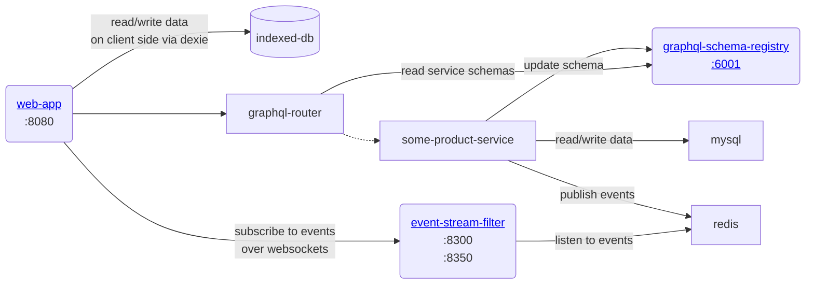
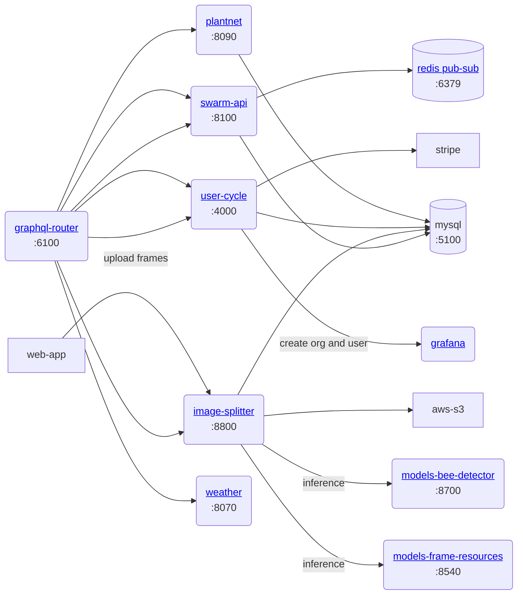

> Goal of this document is to kickstart your development of the web-app as an engineer
## Environment prerequisites

💡 You will need Linux or Mac OSX with **Docker** to develop [Web-app](https://www.notion.so/Web-app-2937ed264e1d434a8664caa4bc40978e?pvs=21) services

To develop [Entrance Observer](https://www.notion.so/Entrance-Observer-b0319799ab7744dc928c08119de4fc43?pvs=21) video processing services you’ll need [Jetson Orin Nano](https://www.notion.so/Jetson-Orin-Nano-0432edfb44f748a6874c41ddefa7f69c?pvs=21) or [Jetson Nano](https://www.notion.so/Jetson-Nano-6500eadfbab64e7b8bd0d0896df30701?pvs=21) to have GPU support and docker image compatibility

## Architecture
### Core services

The following services are mandatory, you will need to git-checkout them and start in the following order:

- mysql ← provides storage for other node and go services
- redis ← provides a pub-sub and caching layer
- graphql-schema-registry ← stores graphql schema of microservices
- graphql-router ← routes API requests to other microservices using a [graphql federation](https://www.apollographql.com/docs/federation/), which basically means that requests are split and routed to the microservice that is responsible for particular part of the schema

### Core services and routing

### Product services

- go-api ← main service that manages domain entities like apiary, hive, hive section, frame, frame side
- image-splitter ← main service that manages image processing + stores data on the detected objects in the frame photo

Note that some service may still be in development and can be unstable or only in draft phase (video processing for example)

## Development setup

Start by checking out [https://github.com/gratheon/web-app](https://github.com/gratheon/web-app). Its just a react single-page app and does not need a docker image but you can see API dependencies it will require. 

Running pure `just start` will allow you to use production backend for frontend development, so you should be able to login with **existing credentials**. Make sure to use email/password for that, as Google login does not work on localhost.

This is most useful in case you need to make cosmetic or FE-only changes that do not alter or introduce any API schema modification.

<iframe width="100%" height="400" src="https://www.youtube.com/embed/T4b2uxrf8U4" title="Making easy web-app changes" frameborder="0" allow="accelerometer; autoplay; clipboard-write; encrypted-media; gyroscope; picture-in-picture; web-share" referrerpolicy="strict-origin-when-cross-origin" allowfullscreen></iframe>

To have full flexibility of schema and backend modification, you will need to  checkout all of the core dependent services based on the architecture diagram and understand how services on the backend are connected

After checkout, for every service

- You’ll need to run `just start` to start docker container
- Set `src/config/config.dev.ts` that was not commited to the repository. Configs typically include credentials to access DB, AWS S3 or external services

💡 Note that some services run DB migrations when they start-up, so make sure you have mysql running and databases pre-created with valid user access. Note that most services do not yet re-connect to mysql automatically, so you need to start services in correct order or restart pod

<iframe width="100%" height="400" src="https://www.youtube.com/embed/dCtL5icnsC0" title="Docs - web-app development 2" frameborder="0" allow="accelerometer; autoplay; clipboard-write; encrypted-media; gyroscope; picture-in-picture; web-share" referrerpolicy="strict-origin-when-cross-origin" allowfullscreen></iframe>

### Optional services

Some services are not blocking the UI or backend in general, but are required for some specific features, so you may need depending on your work:

- models-bee-detector ← detects bees
- event-stream-filter ← sends events to frontend
- gate-video-stream
- models-gate-tracker

## Features

### Bottom Board & Varroa Monitoring

Beekeepers can track varroa mite infestation by uploading images of the hive bottom board.

See [Bottom Board Documentation](../../about/products/web_app/starter-tier/🧮 Hive bottom board & varroa monitoring.md) for user guide and [DB Schema](./🥞 DB schemas/) for table structures.
-   **Image Upload:** Two-step process:
    1. Upload image to S3 via `uploadFrameSide` mutation
    2. Link image to box via `addFileToBox` mutation in image-splitter
-   **Database:** Images stored in `files_box_rel` table with references to `box_id`, `file_id`, and `inspection_id` for versioning
-   **Processing:** Images automatically queued for varroa detection (TYPE_VARROA job)
-   **Services Involved:**
    - **swarm-api**: Box management and BOTTOM type
    - **image-splitter**: File upload, storage, and linking
    - **web-app**: BottomBox component for UI

See [Bottom Board Documentation](../../about/products/web_app/starter-tier/🧮 Hive bottom board & varroa monitoring.md) for user guide and [DB Schema](./🥞 DB schemas/) for table structures.

### Inspection Sharing

Users can share individual hive inspections with others via a unique public URL.

-   **Generating a Link:** From the inspection list view, clicking the "Share" button on an inspection generates a unique URL containing a secure share token.
-   **Public Access:** Anyone with this link can view the specific inspection details without needing to log in.
-   **Read-Only & Scoped:** Access via the share link is strictly read-only. The embedded share token limits data access specifically to the shared inspection and potentially its parent hive/apiary details necessary for context. It prevents access to any other data or the ability to perform modifications.
-   **Security:** Share tokens are validated, and access is controlled by predefined scopes associated with the token. The **GraphQL Router enforces these scopes**, ensuring secure, limited data exposure by blocking unauthorized requests. (See [GraphQL API Authentication](../API/GraphQL.md#share-token-authentication-read-only-access) for technical details).

### Split Colony

Create new hives by moving selected frames from a strong colony. Prevents swarming and enables apiary expansion.

**Technical Overview:**
-   **Mutation:** `splitHive(sourceHiveId, name, frameIds)` - Creates new hive with 1-10 selected frames
-   **Database:** New hive record with `parent_hive_id` and `split_date` tracking
-   **Services:** swarm-api (split logic), web-app (SplitHiveModal UI)
-   **Real-time:** Redis pub/sub broadcasts `hive:split` event

### Join Colony (Merge Hives)

Merge two colonies by moving boxes from source to target hive. Strengthens weak colonies and manages queen genetics.

**Technical Overview:**
-   **Mutation:** `joinHives(sourceHiveId, targetHiveId, mergeType)` - Merges hives with queen management options
-   **Database:** Source hive marked with `merged_into_hive_id`, `merge_date`, `merge_type`
-   **Box Logic:** BOTTOM/GATE boxes stay in source, all others move to target
-   **Services:** swarm-api (merge logic, box movement), web-app (JoinColonyModal UI)
-   **Real-time:** Redis pub/sub broadcasts `hive:join` and `hive:merged` events

