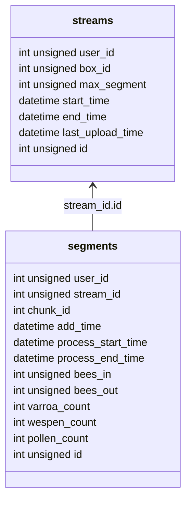

[gate-video-stream](https://github.com/Gratheon/gate-video-stream) stores simple info about videos that are streamed by [entrance-observer](../../entrance-observer/entrance-observer.md)

```mermaid
classDiagram
direction BT
class segments {
   int unsigned user_id
   int unsigned stream_id
   int chunk_id
   datetime add_time
   datetime process_start_time
   datetime process_end_time
   int unsigned bees_in
   int unsigned bees_out
   int varroa_count
   int wespen_count
   int pollen_count
   int unsigned id
}
class streams {
   int unsigned user_id
   int unsigned box_id
   int unsigned max_segment
   datetime start_time
   datetime end_time
   datetime last_upload_time
   int unsigned id
}

segments  -->  streams : stream_id.id
```