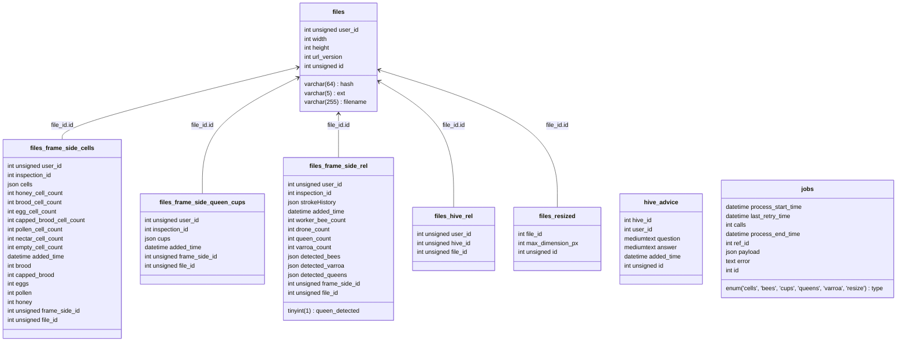

image

```mermaid
classDiagram
direction BT
class files {
   int unsigned user_id
   varchar(64) hash
   varchar(5) ext
   varchar(255) filename
   int width
   int height
   int url_version
   int unsigned id
}
class files_frame_side_cells {
   int unsigned user_id
   int inspection_id
   json cells
   int honey_cell_count
   int brood_cell_count
   int egg_cell_count
   int capped_brood_cell_count
   int pollen_cell_count
   int nectar_cell_count
   int empty_cell_count
   datetime added_time
   int brood
   int capped_brood
   int eggs
   int pollen
   int honey
   int unsigned frame_side_id
   int unsigned file_id
}
class files_frame_side_queen_cups {
   int unsigned user_id
   int inspection_id
   json cups
   datetime added_time
   int unsigned frame_side_id
   int unsigned file_id
}
class files_frame_side_rel {
   int unsigned user_id
   int inspection_id
   json strokeHistory
   datetime added_time
   int worker_bee_count
   int drone_count
   int queen_count
   int varroa_count
   json detected_bees
   json detected_varroa
   json detected_queens
   tinyint(1) queen_detected
   int unsigned frame_side_id
   int unsigned file_id
}
class files_hive_rel {
   int unsigned user_id
   int unsigned hive_id
   int unsigned file_id
}
class files_resized {
   int file_id
   int max_dimension_px
   int unsigned id
}
class hive_advice {
   int hive_id
   int user_id
   mediumtext question
   mediumtext answer
   datetime added_time
   int unsigned id
}
class jobs {
   enum('cells', 'bees', 'cups', 'queens', 'varroa', 'resize') type
   datetime process_start_time
   datetime last_retry_time
   int calls
   datetime process_end_time
   int ref_id
   json payload
   text error
   int id
}

files_frame_side_cells  -->  files : file_id.id
files_frame_side_queen_cups  -->  files : file_id.id
files_frame_side_rel  -->  files : file_id.id
files_hive_rel  -->  files : file_id.id
files_resized  -->  files : file_id.id
```