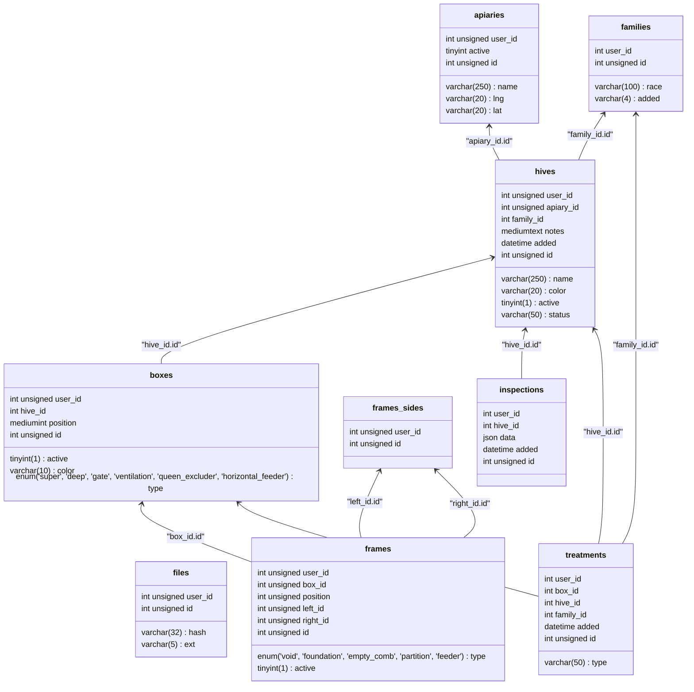

[swarm-api](https://github.com/gratheon/swarm-api) deals with simple storage of main app entities.

Note that frame sides info is extended by image-splitter

```mermaid
classDiagram
direction BT
class apiaries {
   int unsigned user_id
   varchar(250) name
   varchar(20) lng
   varchar(20) lat
   tinyint active
   int unsigned id
}
class boxes {
   int unsigned user_id
   int hive_id
   tinyint(1) active
   varchar(10) color
   mediumint position
   enum('super', 'deep', 'gate', 'ventilation', 'queen_excluder', 'horizontal_feeder') type
   int unsigned id
}
class families {
   int user_id
   varchar(100) race
   varchar(4) added
   int unsigned id
}
class files {
   int unsigned user_id
   varchar(32) hash
   varchar(5) ext
   int unsigned id
}
class frames {
   int unsigned user_id
   int unsigned box_id
   int unsigned position
   enum('void', 'foundation', 'empty_comb', 'partition', 'feeder') type
   int unsigned left_id
   int unsigned right_id
   tinyint(1) active
   int unsigned id
}
class frames_sides {
   int unsigned user_id
   int unsigned id
}
class hives {
   int unsigned user_id
   int unsigned apiary_id
   int family_id
   varchar(250) name
   varchar(20) color
   tinyint(1) active
   mediumtext notes
   datetime added
   varchar(50) status
   int unsigned id
}
class inspections {
   int user_id
   int hive_id
   json data
   datetime added
   int unsigned id
}
class treatments {
   int user_id
   int box_id
   int hive_id
   int family_id
   datetime added
   varchar(50) type
   int unsigned id
}

boxes  -->  hives : "hive_id.id"
frames  -->  boxes : "box_id.id"
frames  -->  frames_sides : "left_id.id"
frames  -->  frames_sides : "right_id.id"
hives  -->  apiaries : "apiary_id.id"
hives  -->  families : "family_id.id"
inspections  -->  hives : "hive_id.id"
treatments  -->  boxes : "box_id.id"
treatments  -->  families : "family_id.id"
treatments  -->  hives : "hive_id.id"
```

