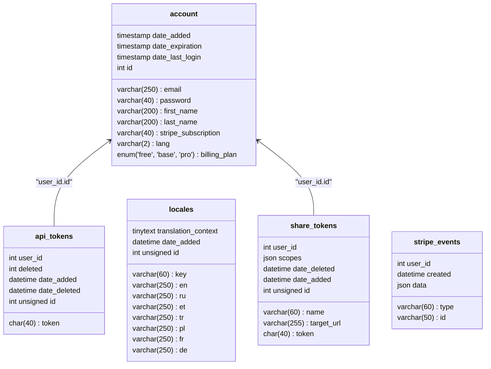

[user-cycle](https://github.com/Gratheon/user-cycle) service deals with user information, API credentials, billing and translations

```mermaid
classDiagram
direction BT

class account {
   varchar(250) email
   varchar(40) password
   varchar(200) first_name
   varchar(200) last_name
   varchar(40) stripe_subscription
   timestamp date_added
   timestamp date_expiration
   timestamp date_last_login
   varchar(2) lang
   enum('free', 'base', 'pro') billing_plan
   int id
}
class api_tokens {
   char(40) token
   int user_id
   int deleted
   datetime date_added
   datetime date_deleted
   int unsigned id
}
class locales {
   varchar(60) key
   varchar(250) en
   varchar(250) ru
   varchar(250) et
   varchar(250) tr
   varchar(250) pl
   varchar(250) fr
   varchar(250) de
   tinytext translation_context
   datetime date_added
   int unsigned id
}
class share_tokens {
   varchar(60) name
   varchar(255) target_url
   char(40) token
   int user_id
   json scopes
   datetime date_deleted
   datetime date_added
   int unsigned id
}
class stripe_events {
   int user_id
   varchar(60) type
   datetime created
   json data
   varchar(50) id
}

api_tokens  -->  account : "user_id.id"
share_tokens  -->  account : "user_id.id"
```
