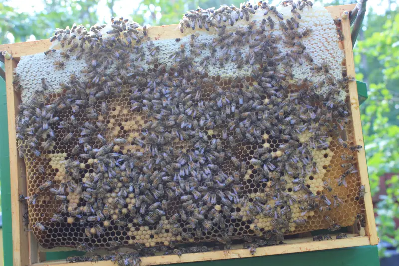

Data collected by us is available via [Google Drive](https://drive.google.com/drive/folders/105PmxDKFUR6NCPLHBkXGdkfcZwWf9ABI?usp=drive_link), mostly due to the size of the data. 
This includes:

## Photos
[Manually taken photos](https://drive.google.com/drive/folders/1exDMgrv8fPcysB4dLQIs-ru7QNW0UPxN?usp=drive_link) from **inspections** of the beehive frames (no annotations, JPG, ~15MP) in years: 2019, 2020, 2021, 2024. 

Example foto (webp re-compressed for the web):


## Videos
[👁️‍🗨️ Entrance Observer](/about/products/entrance_observer/) videos 🎥 of the hive entrance

### 2025

Videos were encoded on the edge as follows:
```
Input #0
  Metadata:
    major_brand     : isom
    minor_version   : 512
    compatible_brands: isomiso2mp41
    encoder         : Lavf59.27.100
  Duration: 00:00:30.03, start: 0.000000, bitrate: 14927 kb/s
  Stream #0:0[0x1](und): Video: mpeg4 (Simple Profile) (mp4v / 0x7634706D), yuv420p, 1280x720 [SAR 1:1 DAR 16:9], 14926 kb/s, 15.02 fps, 15.02 tbr, 12016 tbn (default)
```


#### Dataset type 1
- [September 04](https://drive.google.com/drive/folders/1BY7RrQdQI-6iaSzx4-CVES0kwVlpzX2u?usp=drive_link). 
	- some chunks have pairs with `_detect.mp4` suffixes, showing yolov8 model detections.
	- 5-25mb per chunk. mp4
- [September 05](https://drive.google.com/drive/folders/12oV370f8HqrZsuXUU9mLWeT9NAs8HcO2?usp=drive_link) 
	- Dataset duration ~8h (11:30 - 20:00 EEST)
	- Sunny weather.
	- Zoom at landing board ~ 40cm wide
	- ~ 25GB in total
	- 1280x720px. 30 min chunks. 15FPS. 5-25mb per chunk. mp4
	- file names are in UTC timestamps.
	- [metrics in jsonl format](https://drive.google.com/file/d/18b2aKTxrS1K9YpQciDybXwDlNYuEE4yh/view?usp=drive_link)
	- [bee tracks in jsonl format](https://drive.google.com/file/d/1J6I2KOeUa4dns7OmXidvc6Oqc0VF2goC/view?usp=drive_link)
- [September 6th](https://drive.google.com/drive/folders/1TQxpUFSc13xWLE_0gA4BkzPv8amcFyc-?usp=drive_link). Sunny weather. 
	- Dataset duration ~8h (8:00-15:36, 19:35-20:35 EEST)
	- ~13:20 a flight pattern is seen
	- [metrics in jsonl](https://drive.google.com/file/d/1oHRftj_zvbZXd8vKCcTIg9VRGoslf4vy/view?usp=drive_link)
	- [bee tracks in jsonl](https://drive.google.com/file/d/1SibnVr5I8ifYLJlxiqiWBpNWbBxm7lEl/view?usp=drive_link)

Example video (ffmpeg re-compressed for the web):

<object data={require('./img/videos-at-entrance-example.mp4').default} type="video/mp4" width="640" height="360"></object>

[VIDEO](img/videos-at-entrance-example.mp4)


#### Dataset type 2
- [September 7th](https://drive.google.com/drive/folders/1E8p_d_rdb_Mq2IjoOyw4OVaWrs37xj2s?usp=drive_link)
	- Dataset duration ~ 3h (12:00-15:05 EEST)
	- 1280x720px. 30 min chunks. 15FPS.  
	- Sunny weather with clouds and gust after 16:00
	- **New zoom level** done at 12:00 EEST of landing board area (23cm wide). 
	- [metrics](https://drive.google.com/file/d/1vzIe7SRJP_jarai9jqNIVPac8l6efrQv/view?usp=drive_link)
	- [tracks](https://drive.google.com/file/d/1ij0A15NC2XDdUy3ghvZ6GYT_458uqzZn/view?usp=drive_link)
- [September 8th](https://drive.google.com/drive/folders/1L25SnvC_IDGOZlkE_vWidIPIKZilKURE?usp=drive_link)
	- Dataset duration ~3.5h (13:52-17:33 EEST) at peak time with orientation flights
	- Full duration (8h) available on [youtube](https://youtu.be/oG791JNb1aA)
	- [metrics](https://drive.google.com/file/d/1Uz0I-nzvRPiNe1QH-PK1XcPpCMrfV2NY/view?usp=drive_link)
	- [tracks](https://drive.google.com/file/d/1o9Z6c7-JunYptKTGUFV7aJqYdjkKKYUr/view?usp=drive_link)
- September 9th
	- Dataset duration ~3h (12:00-15:00 EEST)


<iframe width="100%" height="400" src="https://www.youtube.com/embed/oG791JNb1aA" title="YouTube video player" frameborder="0" allow="accelerometer; autoplay; clipboard-write; encrypted-media; gyroscope; picture-in-picture; web-share" referrerpolicy="strict-origin-when-cross-origin" allowfullscreen></iframe>

#### Dataset type 3
Camera placed on **second** hive section (closer), changed zoom, removed glass and aluminium boundaries, added stones instead

- [September 10th](https://drive.google.com/drive/folders/1T9zKrfkNYAl4NHn6E1F8O6stDdiA544f?usp=drive_link)
	- 11:30 - 17:00
- September 11th
	- rainy day, very little activity
- September 13th
	- rainy day
- September 14th
	- cloudy day

<iframe width="100%" height="400" src="https://www.youtube.com/embed/3O4oy4sBHtM" title="Beehive entrance, september 10" frameborder="0" allow="accelerometer; autoplay; clipboard-write; encrypted-media; gyroscope; picture-in-picture; web-share" referrerpolicy="strict-origin-when-cross-origin" allowfullscreen></iframe>


### 2024
[2024, may 19](https://drive.google.com/drive/folders/1bD9uFYu0c2Y4NfKOqTwB-NGl1ZIwEyI1?usp=drive_link). 
	- 640x480 resolution, 10sec chunks
	- white background, lots of shadows.
	- ~ 1h of videos in total, 1.1GB

### 2023
[18-20 july 2023](https://drive.google.com/drive/folders/1qBWlhLSE0Q4B7cw3E0reS8a0RNKdkSI8?usp=drive_link) - small set of videos for testing neural network detection results
- 3840 x 2160, varying positions and length

## External resources that could be used

- Current bee detection model uses yolo v5 weights from [https://universe.roboflow.com/matt-nudi/honey-bee-detection-model-zgjnb](https://universe.roboflow.com/matt-nudi/honey-bee-detection-model-zgjnb)
- Datasets from the Brno team: [https://www.kaggle.com/datasets/imonbilk/bee-dataset-but-1](https://www.kaggle.com/datasets/imonbilk/bee-dataset-but-1) [https://www.kaggle.com/datasets/imonbilk/bee-dataset-but-2](https://www.kaggle.com/datasets/imonbilk/bee-dataset-but-2) [https://www.kaggle.com/datasets/imonbilk/bee-dataset-but-hs](https://www.kaggle.com/datasets/imonbilk/bee-dataset-but-hs)
- roboflow datasets (with annotations) [https://universe.roboflow.com/search?q=varroa](https://universe.roboflow.com/search?q=varroa)
- inaturalist datasets [https://www.inaturalist.org/observations?place_id=any&taxon_id=54328](https://www.inaturalist.org/observations?place_id=any&taxon_id=54328) [https://www.inaturalist.org/observations?place_id=any&taxon_id=47219](https://www.inaturalist.org/observations?place_id=any&taxon_id=47219)

