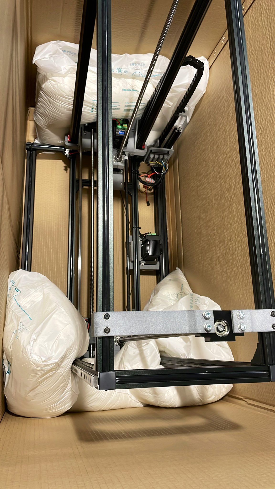
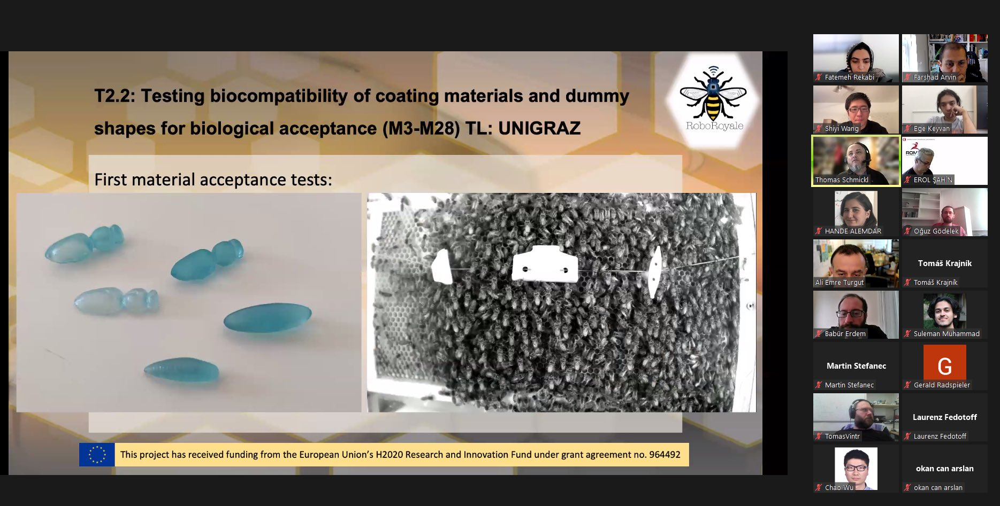
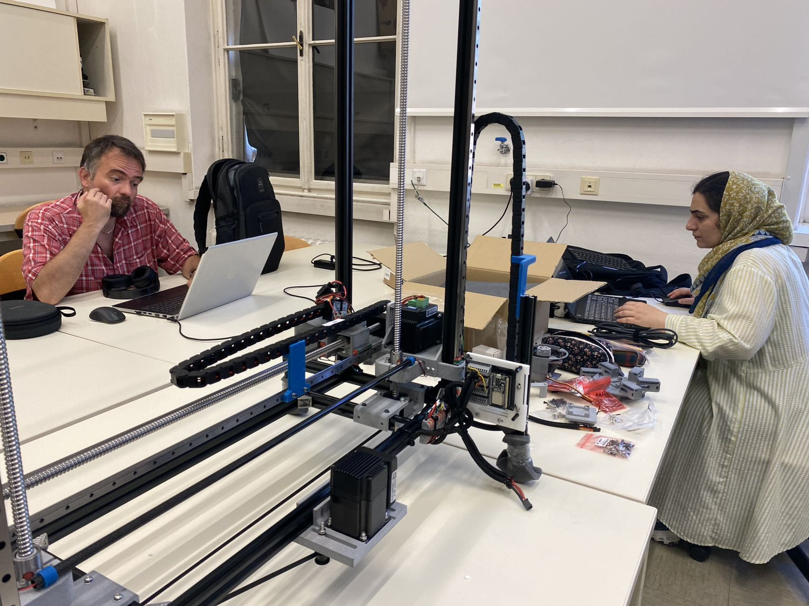
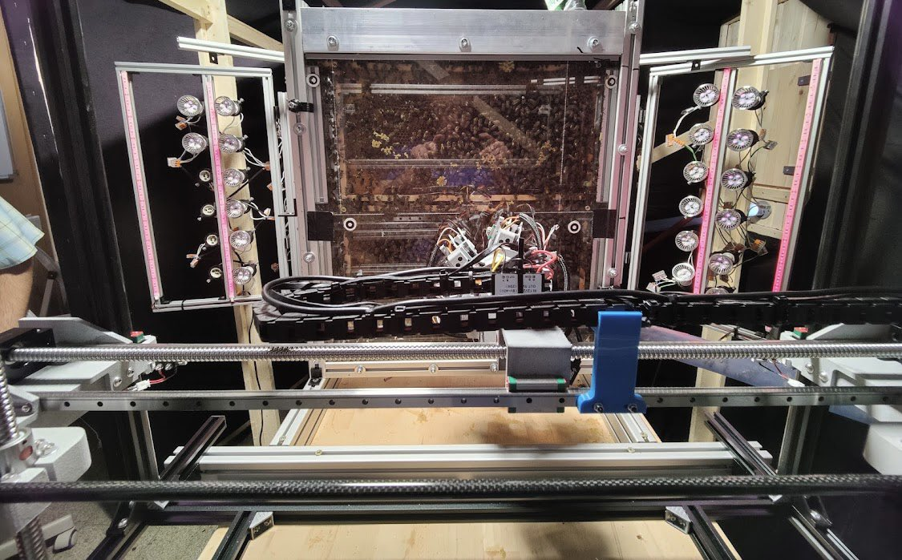
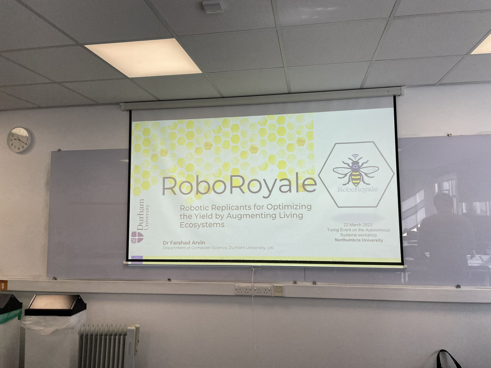
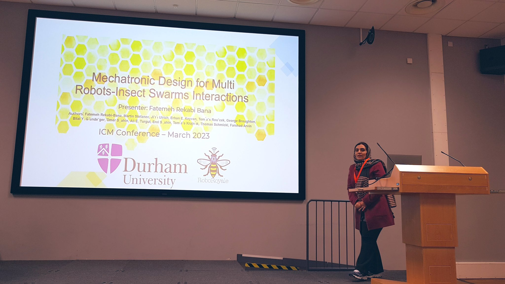
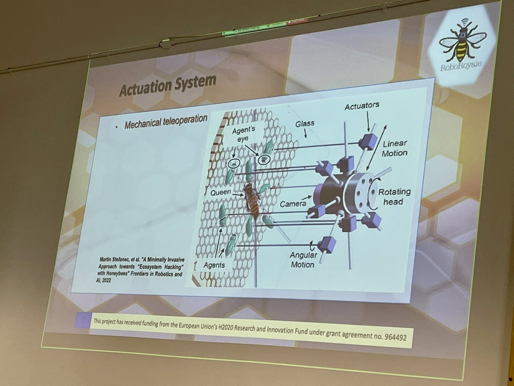
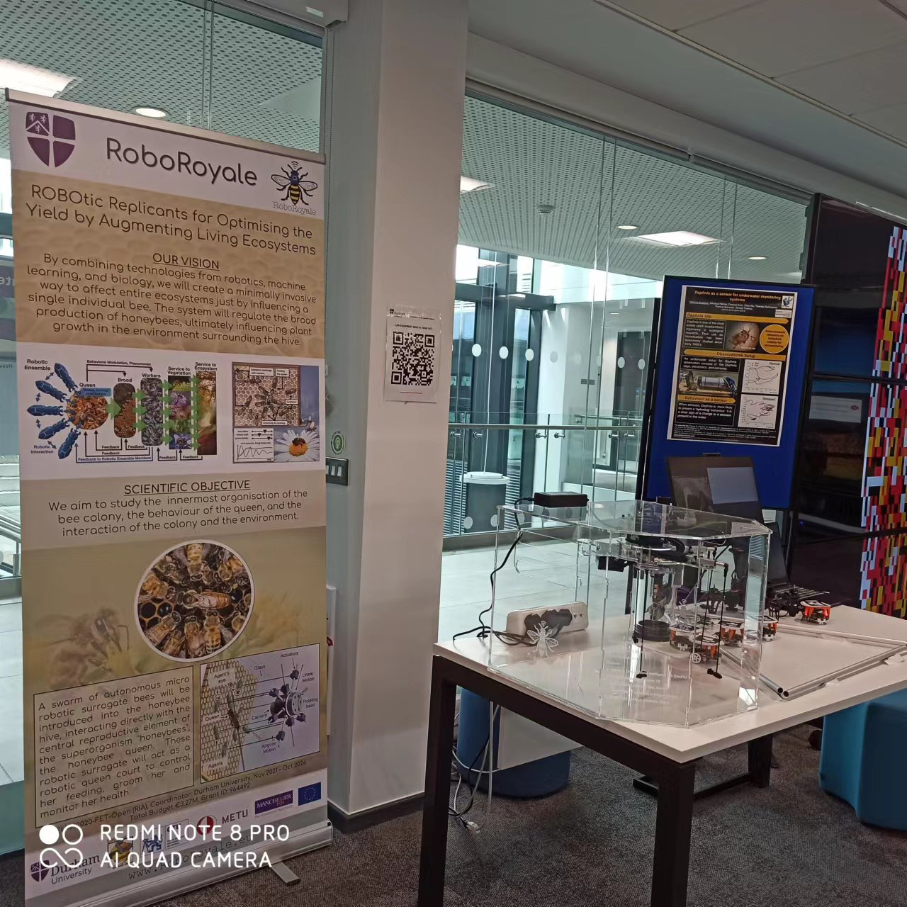
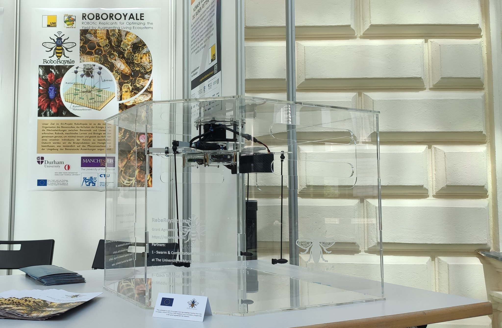

- Project home page: https://roboroyale.eu/home.html
- Official publication: https://www.science.org/doi/10.1126/scirobotics.adn6848#M1
- Our [PDF cache](pdfs/scirobotics.adn6848.pdf)

<object data={require('./pdfs/scirobotics.adn6848.pdf').default} type="application/pdf" width="100%" height="800"></object>

<iframe width="100%" height="400" src="https://www.youtube.com/embed/Wv_iQ3VHyeQ" title="Autonomous tracking of honeybee behaviors over long-term periods with cooperating robots" frameborder="0" allow="accelerometer; autoplay; clipboard-write; encrypted-media; gyroscope; picture-in-picture; web-share" referrerpolicy="strict-origin-when-cross-origin" allowfullscreen></iframe>

<iframe width="100%" height="400" src="https://www.youtube.com/embed/RtaotaaB5SM?list=PLwJcdKVRxEGLCrmPlRZjI0PEkswdf8O9g" title="Dashboard of the AROBA system" frameborder="0" allow="accelerometer; autoplay; clipboard-write; encrypted-media; gyroscope; picture-in-picture; web-share" referrerpolicy="strict-origin-when-cross-origin" allowfullscreen></iframe>

RoboRoyale project is a R&D collaboration between multiple universities to analyze queen bee behaviour using robot-driven camera and transparent (observation) beehive

- see [⭐️ Autonomous tracking of honey bee behaviors over long-term periods with cooperating robots](../papers/⭐️%20Autonomous%20tracking%20of%20honey%20bee%20behaviors%20over%20long-term%20periods%20with%20cooperating%20robots.md)
- [https://x.com/EU_RoboRoyale](https://x.com/EU_RoboRoyale)

